# AdaFrame: Adaptive Frame Selection for Fast Video Recognition

着重对Approach部分做笔记，其他部分都在讲故事、没意义，跳过。

## Abstract

skip

## 1. Introduction

目标是efficient video recognition

一般是均匀取帧，这相当于默认视频信息是均匀分布，但实际上并非如此，均匀取帧会取到无用的背景帧。

分类任务的类别不同，需要的帧数也不同。静态物体的识别只需要一帧，动作类别需要多个帧，同一类别间也有可能需要不同帧数。

AdaFrame, a Long Short-Term Memory (LSTM) network augmented with a global memory,
to learn how to adaptively select frames conditioned on inputs for fast video recognition.

memory-augmented LSTM，at a time step, 检测当前帧，在global memory的帮助下生成一个预测，然后决定下一步选哪个帧。计算取更多帧是否会有更好的效果。

skip

## 2. Related Work

skip

## 3. Approach

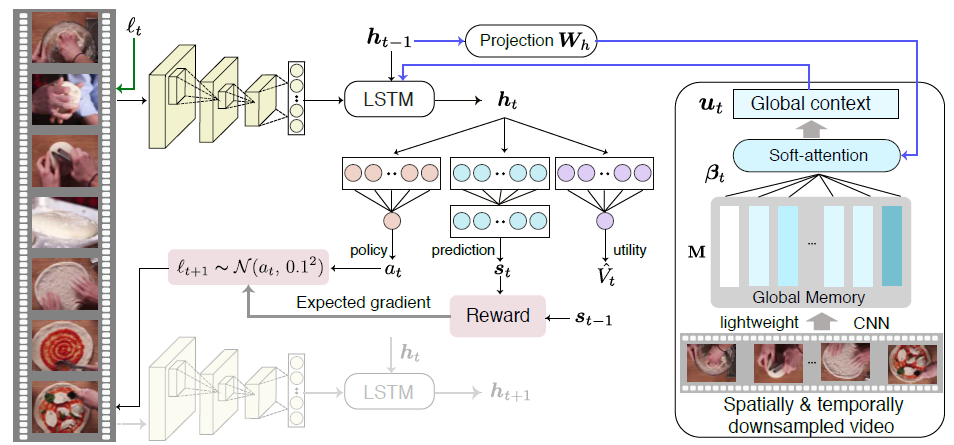

Agent是一个memory-agumented LSTM网络。Agent的输入是一个视频帧序列。在每一个time step处，将

1. 当前帧的特征 **vt**
2. 前一个step的状态**h(t-1)**、**c(t-1)**
3. 从global memory中生成的全局上下文向量**ut**

输入到LSTM中，得到当前time step的隐藏状态**ht**。**ht**随后被用来

1. 通过Prediction network得到prediction向量**st**，用于计算Reward
2. 通过Selection network得到action向量**at**，决定下一步跳到哪个帧
3. 通过Utility network得到utility向量**vt**，用于判断继续取帧的收益。

### 3.1. Memoryaugmented LSTM

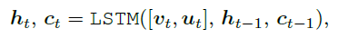

帧特征 **vt** 跟 全局上下文特征 **ut** 拼接起来作为当前LSTM单元的输入。

#### Global memory.

global memory部分用于提供上下文信息，它的输入是经过空间和时间上降采样取到的帧的集合，用一个lightweight CNN分别提取他们的特征，得到特征集合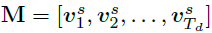，Td代表帧数（Td<T）。通过降采样限制输入的帧数以及使用一个轻量级CNN，保证了global memory部分计算开销比较小。

由于只是分别对各个帧使用2D CNN，没有利用到时间信息，因此用到了position encoding方法来将位置信息嵌入到frames representations中。

用soft-attention来获取global context information：根据上一个time step的隐藏状态h(t-1)来给每个frame representation加上attention权值

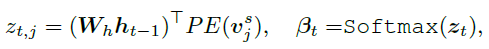

权值矩阵Wh将h(t-1)映射到跟 vj 同样的维度上，PE代表给 vj 加上一个位置向量。z(t,j)是两个向量的内积结果，代表了向量 vj 的在time step t 的attention权值。再对attention权值向量求softmax得到Beta(t)，此时Beta(t)是normalized attention vector over the memory。最后将权值Beta(t)赋予各个frame representation后取平均，得到向量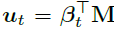

#### Prediction network.

prediction network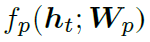通过一个权值矩阵Wh（就是一个fc）将隐藏状态ht映射到输出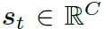，C是类别数，再经过softmax函数得到prediction向量，代表其属于各个类别的可能性。用最后一个time step Te的prediction与该视频的真实one-hot label之间交叉熵来训练网络：

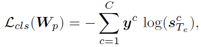

应该有Te<<T，因为希望用的帧越少越好。

#### Reward function.

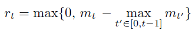

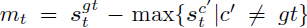代表了预测出来的对于ground-true类别的可能性与其他类别的可能性的最大值之间的差距。优化过程中会增大这个差距。而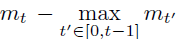激励这个margin比历史margin更大。这样设计Reward function的目的是衡量加入这个帧是否有助于加大ground-true class的probability，这个帧是否是imformative的。

#### Selection network.

Selection network fs 用来决定下一个time step看哪一帧。

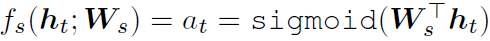

直接用一个全连接层将隐藏状态ht映射到一个value上。然后再加上一个高斯分布采样（方差固定为0.01）

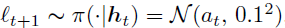

加入高斯分布的目的是在训练过程中加入噪声。在inference阶段不用高斯分布采样，直接用at，乘以总帧数就是下一帧的位置。可以发现下一帧不一定是后面的帧，也可以是前面的帧。

这样训练selection network来最大化期望reward：

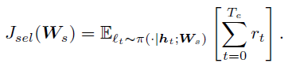

#### Utility network.

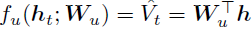

用一个全连接层将ht映射成向量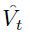代表an approximation of expected future rewards，此外expected future rewards也可以这样计算：

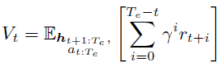

通过以下损失函数来训练utility network：

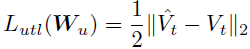

#### Optimization.

综合上面三个损失函数，最终的目标函数为：

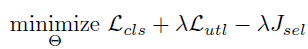

前两个可微，用SGD自动反向传播更新参数即可。

因此只看期望reward Jsel的gradient：

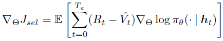

作为baseline减小方差。Rt代表expected future reward。在一个mini-batch中用Monte-Carlo sampling来拟合。

### 3.2. Adaptive Lookahead Inference

前面讲到的utility network用来预测expected future rewards，看到将来取更多帧所带来的好处。因此根据utility network的输出来决定继续或者停止取帧。在每个time step都计算，并记录最大值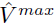，如果超过p次有>+margin，就停止。

## 4. Experiments

### 4.1. Experimental Setup

#### Datasets and evaluation metrics.

- FCVID：91, 223 videos from YouTube. 共239个类别，平均167秒。trainset：45, 611  testset：45, 612
- ACTIVITYNET：20K videos，共200个类别。平均117秒。train,val,test=10, 024 vs 4, 926 vs 5, 044。用val作为test。

评估指标：mAP

#### Implementation details.

单层LSTM，FCVID用2048个隐藏层单元，ACTIVITYNET用1024个。

输入方面，每秒取一帧，经过ResNet101后取倒数第二层得出的1000-dim向量作为帧特征。ResNet在ImageNet上预训练过，还在这两个数据集上进行finetune。

global memory部分，把帧分辨率降采样为112*112，均匀取16帧。lightweight CNN取pretrained MobileNetv2

### 4.2. Main Results

#### Effectiveness of learned frame usage.

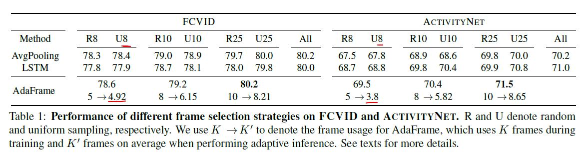

这效果也太强了吧。。。

#### Computational savings with adaptive inference.

Use **average GFLOPs** to measure the computation needed to classify all the videos in the testing set.

AdaFrame-K代表训练时用的是K个time step。

在数据集FCVID上，对比25帧的AVGPOOLING和LSTM，AdaFrame-10少用了58.9%的GFLOPs。其他同理。

其余SKIP。

### 4.3. Discussions

#### Global memory.

用ablation study测试global memory部分要用多少个帧。结果16帧是最好的。

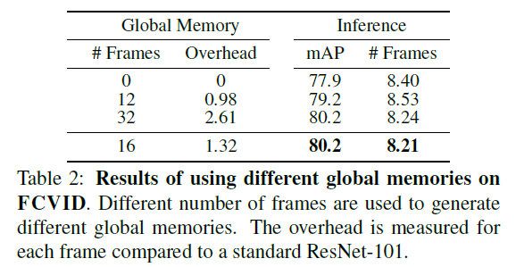

0帧代表不用global memory，mAP其实也就差两个点而已。

其余SKIP。