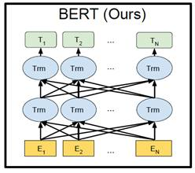
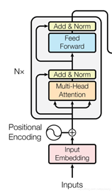
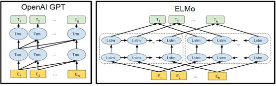
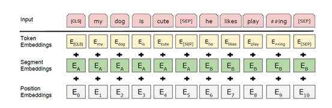
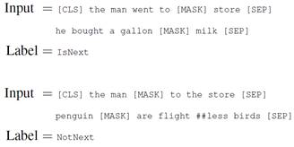

BERT的全称是Bidirectional Encoder Representation from Transformers，即双向Transformer的Encoder。模型的主要创新点都在pre-train方法上，即用了Masked LM和Next Sentence Prediction两种方法分别捕捉词语和句子级别的representation。

Bert只用了Transformer中的Encoder结构

其中的Trm就是Transformer中的Encoder结构

Bert是双向结构，

以上两种模型用于对比，可见OpenAI GPT只是单向，ELMo是双向但不是真正的双向，因为它分别以P(Wi | W1, W2, … Wi-1)和P(Wi | Wi+1, … Wn) 为目标函数独立训练两个represnetation然后拼接，而bert是以P(Wi |W1,…,Wi-1, Wi+1, …,Wn)为目标函数训练LM任务。

 

 

Bert超参数中，L表示网络的层数（即Transformer blocks的数量Nx），H表示隐层大小，A表示Multi-Head Attention中self-Attention的数量/heads数量，feed-forward/filter 的尺寸是4H（即H = 768时为3072）。

  BERT的本质上是通过在海量的语料的基础上运行自监督学习方法为单词学习一个好的特征表示，所谓自监督学习是指在没有人工标注的数据上运行的监督学习。在以后特定的NLP任务中，我们可以直接使用BERT的特征表示作为该任务的词嵌入特征。所以BERT提供的是一个供其它任务迁移学习的模型，该模型可以根据任务微调或者固定之后作为特征提取器。（也就是可以做Word2Vec的替代者）

从Word2vec到AllenNLP ELMo，从OpenAI GPT到BERT的不同。

Word2vec本身是一种浅层结构，而且其训练的词向量所“学习”到的语义信息受制于窗口大小；因此后续有利用可以获取长距离依赖的LSTM语言模型预训练词向量。此外，Word2Vec无法区分多义词的不同语义，因为同一个单词只能被编码成同一个向量，无论上下文单词是什么样的。

LSTM是根据句子的上文信息来预测下文的，或者根据下文来预测上文，传统的LSTM模型只学习到了单向的信息。ELMO的出现在一定程度上解决了这个问题。

ELMO是一种双层双向的LSTM结构，其训练的语言模型可以学习到句子左右两边的上下文信息，但此处所谓的上下文信息并不是真正意义上的上下文。

OpenAI GPT利用了transform的编码器作为语言模型进行预训练的，之后特定的自然语言处理任务在其基础上进行微调即可，和LSTM相比，此种语言模型的优点是可以获得句子上下文更远距离的语言信息，但也是单向的。BERT的出现，似乎融合了它们所有的优点，并摒弃了它们的缺点，因此才可以在诸多后续特定任务上取得最优的效果。

Token embedding: 单词的embedding

Segment embedding：区分单词属于第一个句子还是第二个句子

Position embedding：代表单词的位置信息，和Transformer中的Position embedding不一样，它不是三角函数计算得出，而是学习出来的。

 

Pre-training Tasks

1.Masked Language Model

在训练过程中15%的WordPiece Token会被随机Mask掉，然后只需要预测这些被Mask掉的单词，损失函数只计算被mask掉那些token，而不是把像cbow一样要预测每个单词。最终的。对于一个确定要被Mask掉的单词，80%的时候会直接替换为[Mask]，10%的时候将其替换为其它任意单词，10%的时候会保留原始Token。

·         80%：my dog is hairy -> my dog is [mask]

·         10%：my dog is hairy -> my dog is apple

·         10%：my dog is hairy -> my dog is hairy

这么做的原因是如果句子中的某个Token 100% 都会被mask掉，那么在fine-tuning的时候模型就会有一些没有见过的单词。加入随机Token的原因是因为Transformer要保持对每个输入token的分布式表征，否则模型就会记住这个[mask]是token ’hairy‘，随机词替换会给模型增加一点点噪声，但是因为此时模型不知道哪个词是被随机换了(不像[MASK]，给模型[MASK]则模型知道此处词的是被挖了，他需要预测这个位置是啥)，所以就迫使他去更好地保留每个词的词义，为下游任务提供方便。至于单词带来的负面影响，因为一个单词被随机替换掉的概率只有15%*10% =1.5%，这个负面影响其实是可以忽略不计的。

用Mask的意义是：之前使用的单向语言模型进行预训练不同，BERT使用遮蔽语言模型来实现预训练的深度双向表示。单向语言模型在学习的时候是从左向右进行学习的，根据前文单词预测下一个单词，而Bert则是根据上下文单词预测中间被Mask的单词。

​       这个mask中间挖空预测的方法，我感觉跟Word2Vec中的CBOW相似，都是根据上下文单词预测中间的单词。

2.Next Sentence Prediction

判断句子B是否是句子A的下文，随机抽取语句对，其中50%是连续语句对，50%是不连续语句对，

IsNext、NotNext这个关系保存在[CLS]符号中。它首先在每个sequence（对于句子对任务来说是两个拼起来的句子，对于其他任务来说是一个句子）前面加了一个特殊的token[CLS]。然后让encoder对[CLS]进行深度encoding，深度encoding的最高隐层即为整个句子/句对的表示。Transformer是可以无视空间和距离的把全局信息encoding进每个位置的，而[CLS]作为句子/句对的表示是直接跟分类器的输出层连接的，因此其作为梯度反传路径上的“关卡”，当然会想办法学习到分类相关的上层特征啦。

sentence级别的任务对于阅读理解，推理等任务提升较大。

 

优点

（1）使用的是Transformer，也就是相对rnn更加高效、能捕捉更长距离的依赖。对比起之前的预训练模型，它捕捉到的是真正意义上的bidirectional context信息。

（2）模型有两个 loss，一个是 Masked Language Model，另一个是 Next Sentence Prediction。前者用于建模更广泛的上下文，通过 mask 来强制模型给每个词记住更多的上下文信息；后者用来建模多个句子之间的关系，强迫 [CLS] token 的顶层状态编码更多的篇章信息。

缺点

每个batch只预测15%的token，训练时间比普通的left-to-right模型（依个预测所有单词）长。

 