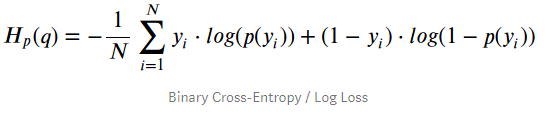
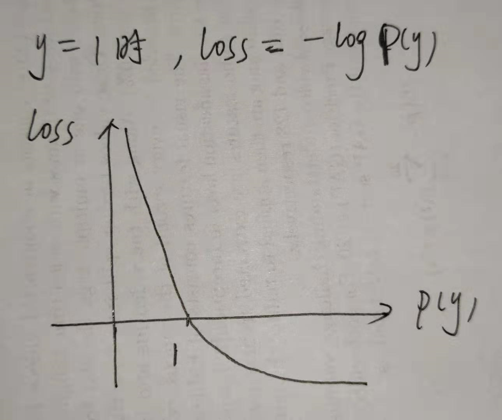
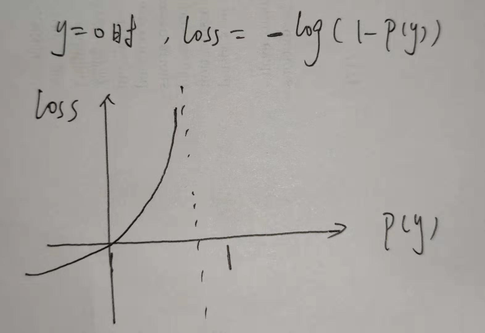
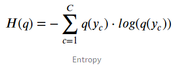
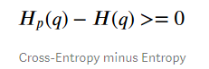

 参考[Understanding binary cross-entropy / log loss](https://towardsdatascience.com/understanding-binary-cross-entropy-log-loss-a-visual-explanation-a3ac6025181a)

此笔记有内容与[机器学习逻辑回归算法原理、伪代码及实现效果展示](https://blog.csdn.net/weixin_41519463/article/details/79790817)  [交叉熵(cross_entropy)](https://blog.csdn.net/weixin_41519463/article/details/101102063)重合

## Introduction

训练一个二元分类器（ **binary classifier**）的时候，往往会用到**binary cross-entropy** / **log loss**作为损失函数。下面详细介绍这个损失函数**binary cross-entropy**

## A Simple Classification Problem

比如说给10个点分类，只要两个类别：Green or Red。设Green为positive，label=1，Red为negative，label=0.

训练一个bianry classifier的作用就是得出某一个点属于positive的概率。

评估预测概率的好坏标准：损失函数**binary cross-entropy**

## Loss Function: Binary Cross-Entropy / Log Loss

- **y** is the **label** (**1** **for** **positive** points and **0** **for** **negative** points) 
- **p(y)** is the predicted **probability of the point being positive** for all **N** points.

公式设计的目的：（注：p(y)代表该样本属于positive的概率 ）

- 对于positive样本 y=1，loss= *- log(p(y))* , 当p(y)越大时，loss越小。最理想情况下p(y)=1，loss=0

- 对于negative样本 y=0，loss= *- log(1-p(y))*, 当p(y)越小时，loss越小。最理想情况下p(y)=0，loss=0

因此 Binary Cross-Entropy 作为损失函数能够度量分类的准确性。降低loss的过程就使得

- y=1的样本，得到的预测概率p(y)变大
- y=0的样本，得到的预测概率p(y)变小

补充：

## Entropy

熵(entropy)用来衡量一个分布q(y)的不确定性。假如样本全是positive的，那就没有不确定性了，因为样本必然是positive的，此时熵=0 。当样本一半是positive一半是negative的时候，不确定性是最大的，此时熵也是最大的。

熵的计算公式：

## Cross-Entropy

q(y)是真实分布，p(y)是预测的分布。计算两个分布之间的交叉熵：

假设模型完美，则q(y)=p(y)，此时会有 **交叉熵 = 熵**。但这基本不可能，一般交叉熵会比在真实分布上计算出来的熵要大：

这个差值叫KL散度

## Kullback-Leibler Divergence

**KL Divergence**用来衡量两个分布之间的不相似性（**dissimilarity** ）。

两个分布越相似，KL散度值越小。