# BlockDrop: Dynamic Inference Paths in Residual Networks

## Abstract

更深的CNN效果更好，但参数量太大。BlockDrop就是学习如何在不降低预测精度的前提下动态地选择去掉CNN中的某些层以减少计算量。基础网络是pretrained ResNet-101，对于一个给定的新图片，用强化学习方法在线决定丢弃哪些residual blocks。实验数据集CIFAR、ImageNet。

## 1. Introduction

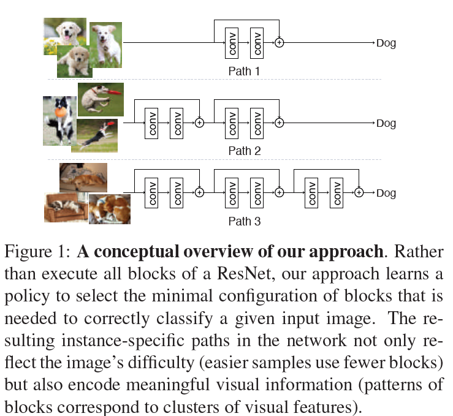

The main idea is to learn a model(referred to as the policy network) that, given a novel input image, outputs the posterior probabilities of all the binary decisions for dropping or keeping each block in a pretrained
ResNet.

The policy network is trained using curriculum learning to maximize a reward that incentivizes the
use of as few blocks as possible while preserving the prediction accuracy.

In addition, the pretrained ResNet is further jointly finetuned with the policy network to produce feature transformations tailored for block dropping behavior

## Related Work

#### Layer Dropping in Residual Networks

#### Model Compression

Techniques to reduce storage and computaional costs: knowledge distillation, low-rank factorization, filter pruning, quantization, compression with structured matrices, network binarization, and hashing.

上述的方法是通用于所有输入样本，而本文的方法是根据输入图片的不同来动态选择去除一些blocks的。

#### Conditional Computation

Sparse activations in combination with gating functions are usually adopted to selectively turn on and off a subset of modules based on the input. These gating functions can be learned with reinforcement learning. These models typically associate a reward with a series of decisions computed after each layer/path. 因为模型层数很多，所以计算开销很大。而本文算法只计算一次reward，开销低。

#### Early Prediction

本文模型属于early prediction models, 就是一旦符合某种标准后就不再经过剩下的神经网络层，直接离开。

## 3. Approach

Converting a soft-attention mask into binary decisions would require carefully handcrafted thresholds. Such a thresholding operation is non-differentiable.

本文使用强化学习中的policy search methods来求出最优的 block dropping 策略。

### 3.1. Pretrained Residual Networks

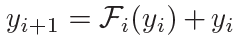

其中yi是当前residual block的输入，Fi是residual block function，y(i+1)是当前残差块输出，也是下一个残差块输入。

有时候在test time直接去掉一个残差块[^y(i+1)=yi]对结果影响不大，但是去掉的block越多，图像分类错误率越大，这是因为对所有图片使用了global dropping策略。本文的instance-specific dropping策略能在使用最少数量的blocks的情况下保持预测的准确率。

### 3.2. Policy Network for Dynamic Inference Paths

Configurations of a ResNet: decisions to keep/drop each block.

we develop a policy network to output a binary policy vector, representing the actions to keep or drop a block in a pretrained ResNet.

During training, a reward is given considering both block usage and prediction accuracy, which is generated by running the ResNet with only active blocks in the policy vector.

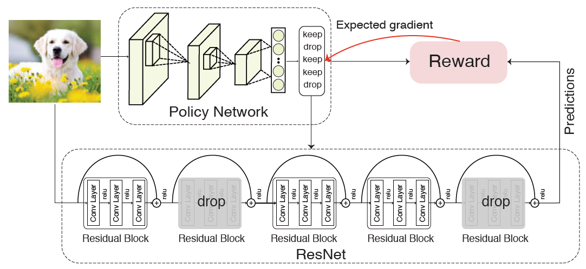

与标准的RL不同，本文训练出来的policy一次性预测出所有的actions。

***

给定输入图片x和一个含有K个residual block的预训练ResNet，**Policy**为：

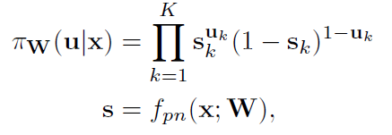

- fpn代表policy network（本文选的policy network结构较简单，不会增加太多开销，就是说不会导致学习policy 的开销比dropping residual block省下来的开销大）

- W代表network的参数
- s代表network最后的全连接层经过sigmoid激活函数后的输出。s的第k个元素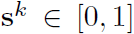代表丢弃第k个残差块的可能性。
- 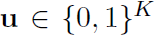是根据s选定的action，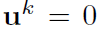代表drop第k个残差块，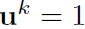代表keep

***

设计**Reward**函数：

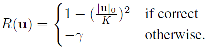

- 预测错误的时候给出负值reward，gamma参数值越大，惩罚力度越大，越倾向于保留更多block，来提高预测准确率，同时也降低效率。

- 预测正确的时候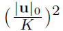代表保留的blocks的百分比，保留的越少，reward越大。

***

网络优化目标：使期望reward最大化

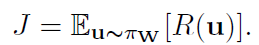

***

总的来说，policy network用来决定保留哪些残差块，ResNet使用保留的残差块生成prediction，然后通过综合correctness和efficiency来得到reward。

### 3.3. Training the BlockDrop Policy

#### Expected gradient.

为了最大化期望reward J ，使用policy gradient优化policy network。

传统RL，从多项式分布中采样policy；本文RL从K维伯努利分布中生成policy。

> 伯努利分布(Bernoulli distribution)也叫01分布。伯努利试验为“是或否”的问题。进行一次伯努利试验，成功(X=1)概率为p(0<=p<=1)，失败(X=0)概率为1-p，则称随机变量X服从伯努利分布。
>
> 二项分布(Binomial distribution)是**n重伯努利试验**成功次数的离散概率分布。二项分布的典型例子是扔硬币，硬币正面朝上概率为p, 重复扔n次硬币，k次为正面的概率即为一个二项分布概率。**伯努利分布是二项分布在n=1时的特例**。
>
> 多项式分布(Multinomial Distribution)是二项式分布的推广。二项式做n次伯努利实验，规定了每次试验的结果只有两个，如果现在还是做n次试验，只不过每次试验的结果可以有多m个，且m个结果发生的概率互斥且和为1，则发生其中一个结果X次的概率就是多项式分布。**扔骰子是典型的多项式分布**。
>
> [参考博客](https://blog.csdn.net/kingzone_2008/article/details/80584743)

给定，在一个mini-batch中用Monto-Carlo对所有samples采样，计算Gradient：

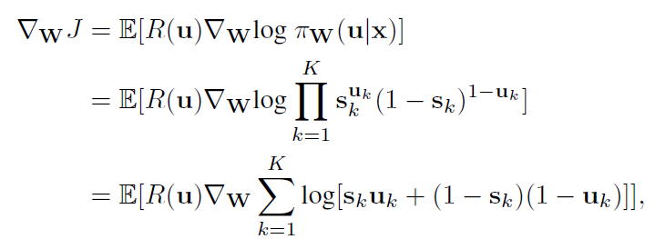

事实上用tensorflow或pytorch框架的时候，能自动求梯度，不需要我们自己来计算。

**<u>公式存疑：</u>**

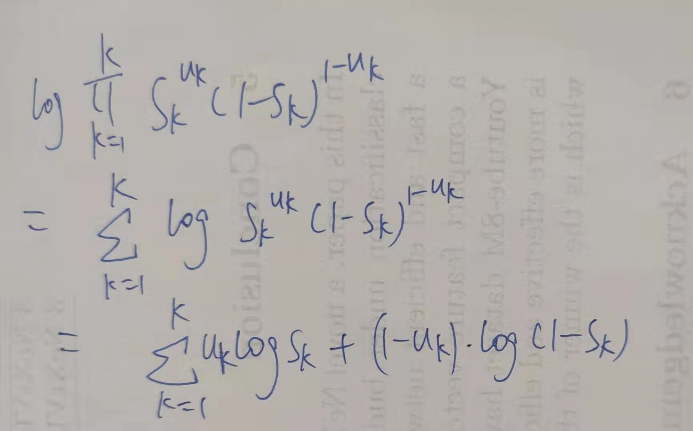

邮件问了作者后，终于明白了，论文公式并没有错，这类似于逻辑回归。具体参考[BlockDrop_exp](https://github.com/zhongzhh8/PaperReading/blob/master/BlockDrop_exp.md)的Loss Function部分

W代表policy network的参数。

>  <u>**Monte-Carlo sampling**</u>这是什么东西！？

These gradient estimates are unbiased, but exhibit high variance.   无偏差，但方差高？

To reduce variance, we utilize a **self-critical baseline** 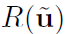，并重写梯度公式

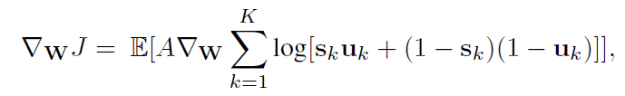

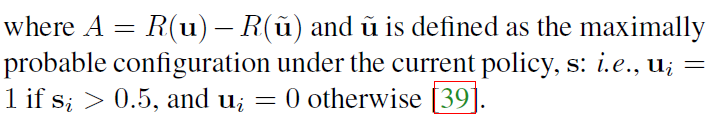

> **self-critical baseline**就是Tip1，防止所有reward都是正数。就是说当前reward比baseline reward要大的时候才认为这是个好的结果，应该继续弘扬。

什么叫<u>maximally probable configuration</u>，他自己本身是根据伯努利分布，从s得到u的。

然后还要加一个参数alpha对s进行处理

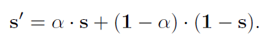

使得概率分布s‘限制在范围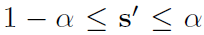内。**<u>这样有什么意义？只是一个小tip</u>**

#### Curriculum learning.

Policy gradient methods对初始化很敏感，随机初始化效果差，因为搜索空间太大。

为了找到较好的action sequences，借鉴curriculum learning。就是跑K个epoch，在epoch t 时，保持ResNet的前 K-t 个blocks on，只在后t个blocks上学习policy，随着t增大，直到最后在所有block上学习policy。然后t>=K时就一直在这个所有的blocks上学习 。

#### Joint finetuning.

训练policy network的同时finetune ResNet来适应residual blocks dropping。

网络训练过程伪代码：

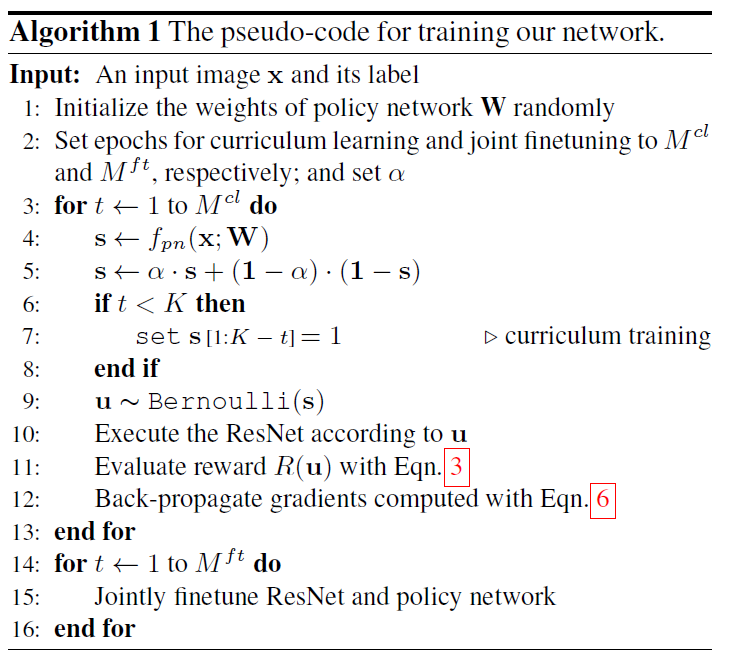

实验先后分为两部分：

1. 进行Curriculum Learning，frozen pretrained ResNet110，训练policy network。训练完毕后保存成checkpoint。
2. 进行Joint Finetuning，ResNet110和policy network一起训练。训练完毕后保存成checkpoint。

## 4. Experiment

### 4.1. Experimental Setup

##### Datasets and evaluation metrics.

- CIFAR-10, CIFAR-100： 60,000张32x32的images,  训练集50,000张，测试集10,000张。CIFAR-10有10个类别，CIFAR-100有100个类别。评估指标：classification accuracy

- IMAGENET (ILSVRC2012)：1000个类别，训练集1.2M张images，验证集50,000张images作为测试集。评估指标：top-1 accuracy （不就是classification accuracy吗？）

##### Pretrained ResNet.

- CIFAR-10, CIFAR-100：ResNet-32 and ResNet-100
- IMAGENET：ResNet-101    四个部分<u>**[3, 4, 20, 3]**</u>，这跟网上的标准数[3, 4, 23, 3]不一样啊。。。显然是错了呀！

##### Policy network architecture.

- CIFAR ：ResNet with 3 blocks(equivalently ResNet-8)

- ImageNet：ResNet with 4 blocks (equivalently ResNet-10)。数据集图片降采样为112x112再输入到policy network中。

policy network的计算开销比ResNet小得多。

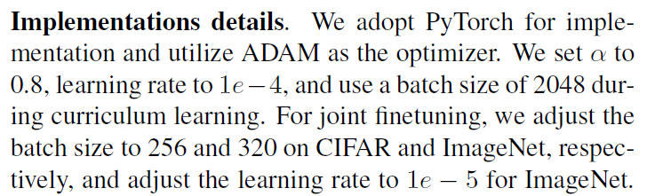

### 4.2. Quantitative Results

skip

### 4.3. Qualitative Results

skip

## 5. Conclusion

skip