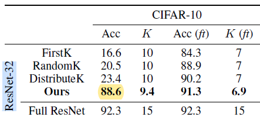
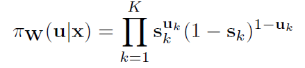
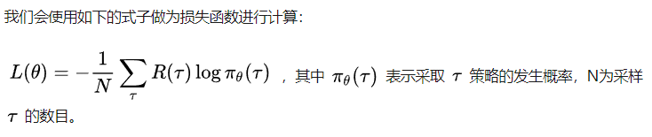
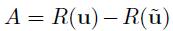
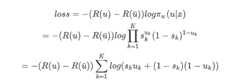
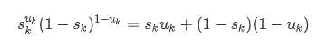
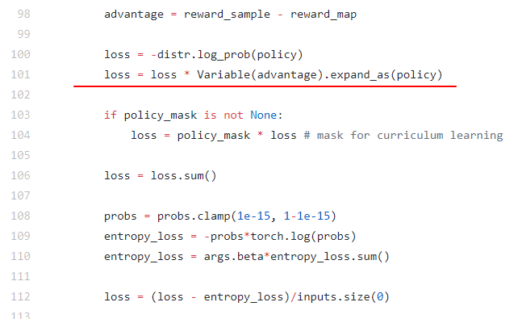
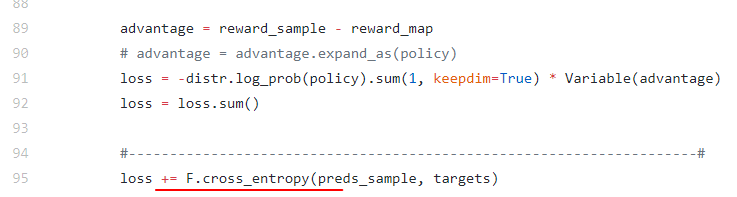

论文BlockDrop的实验代码[github地址](https://github.com/Tushar-N/blockdrop#testing-and-profiling)

以Cifar10、ResNet32为例。

原本代码是默认跑R110C10的，但是由于代码需要加载pretrained ResNet和Policy，本身checkpoint就是作者在一个显卡上跑出来的，我加载模型的时候也只能用一个显卡跑，没办法只能选最小的ResNet32，而且原本在论文中CIFAR10就是能够搭配ResNet32和ResNet110。

实验先后分为两部分：

1. 进行Curriculum Learning，frozen pretrained ResNet32，训练policy network。训练完毕后保存成checkpoint。
2. 进行Joint Finetuning，ResNet32和policy network一起训练。训练完毕后保存成checkpoint。

但是由于ResNet32还是太大，显存不够用，只能是frozen，如果finetune的话很可能是跑步起来的，或者说抢不到这么多显存。加上Curriculum Learning和Joint Finetuning其实从代码上来说差别不大，干脆先看Curriculum Learning再说，后面有时间再看Joint Finetuning能不能跑起来。

论文中的结果：



ResNet32有15个blocks。层数=1个卷积层+ 15*2 个卷积层+1个fc = 32层

> ResNet110有15个blocks。层数=1个卷积层+ 54*2 个卷积层+1个fc = 110层

Policy Network是一个ResNet8，有3个block，层数=1个卷积层+ 3*2 个卷积层+1个fc = 8层


目前跑到0.874，似乎是差不多了。现在要做的就是跑代码的同时看代码实现细节，仅此而已。

```ssh
python cl_training.py --model R32_C10 --cv_dir cv/R32_C10_cl/ --lr 1e-3 --batch_size 2048 --max_epochs 5000 --load /home/disk1/azzh/PycharmProject/blockdrop/cv/R32_C10_cl/ckpt_E_670_A_0.879_R_8.10E-02_S_12.98_#_87.t7
```

train的过程：

- 取出一个batch的数据inputs、targets

- probs, _ = agent(inputs) 将图片输入policy network得到概率分布s，15个block的keep or drop

- s从实数值变01：policy_map是baseline，policy是用伯努利分布得到的

- 根据policy进行keep or drop，将图片输入resnet得到输出的preds_map和preds_sample

- 根据targets和preds_map, preds_sample，计算得到两个reward，advantage=reward_sample - reward_map，可以认为将这个advantage作为真正的reward

- ```python
  loss= -Bernoulli(probs).log_prob(policy) * advantage 
  loss = policy_mask * loss  #只取要训练的部分的block生成的loss
  ```

> policy gradient里，loss函数的设置是最关键的，loss并不是直接等于 -reward ，reward只是充当权重系数。
>
> 
>
> 这部分必须再看一次policy gradient才行。原来损失函数才是最重要的。要想明白为什么是这么设计的，以及这里的PI到底为什么这样写。
>
> 参考我写的另一份关于policy gradient的公式推导的笔记：[**PolicyGradient结合blockdrop讲解**](https://blog.csdn.net/weixin_41519463/article/details/101168782)


## Loss Function

### 1. Loss

在blockdrop中：


> 这个PI的公式是逻辑回归里的内容，参考[机器学习逻辑回归算法原理、伪代码及实现效果展示](https://blog.csdn.net/weixin_41519463/article/details/79790817)
>
> uk=1时PI=sk;   uk=0时PI=1-sk
>
> 因此PI 必是s属于u的概率，或者说p代表了准确度。

再加上

所以loss函数应该是：
$$
loss=-(R(u)-R(\bar{u}))log\pi_w(u|x)  \\
=-(R(u)-R(\bar{u}))log\prod_{k=1}^Ks_k^{u_k}(1-s_k)^{1-u_k}  \\
=-(R(u)-R(\bar{u}))\sum_{k=1}^K log(s_ku_k+(1-s_k)(1-u_k))
$$

> markdown公式符号参考[Markdown常用符号及排版](https://blog.csdn.net/u013914471/article/details/82973812)
>
> github公式格式有误，看

这里面的公式化简确实是没错的：
$$
s_k^{u_k}(1-s_k)^{1-u_k}=s_ku_k+(1-s_k)(1-u_k)
$$

> github公式格式有误，看

因为uk只能取0或1，分别代入0或1，左右都成立。

所以终于明白为什么代码中用到了[Binary_Cross_Entropy](https://github.com/zhongzhh8/PaperReading/blob/master/Binary_Cross_Entropy.md)了


现在看懂了前半部分：




### 2.entropy_loss

上图是cl_training.py里的lossfunction部分，将预测向量probs的熵（entropy）加入到loss里面

首先entropy的公式：

对应了代码的第109行，然后他还加了个权重beta=0.1

那么为什么要加熵呢？参考作者给的链接[A3C: We add entropy to the loss to encourage exploration](https://github.com/dennybritz/reinforcement-learning/issues/34)

probs的熵代表了分布的不确定性，loss=loss-entropy，然后反向传播优化loss的时候entropy就会增大。

- 熵较大，probs的值倾向于向0.5靠拢。
- 熵较小，probs的值倾向于向0或者1靠拢。

所以说加上entropy就是为了防止过早拟合，使得policy能进行更远的探索，而不是学两步就马上定住了。

所以 **adding entropy to loss will encourage exploration**


### 3.cross_entropy



在cl_training部分用到了entropy_loss来encourage exploration，而在finetune.py中不再使用entropy_loss，因为在前面的部分基本已经探索完了。他使用了cross_entropy，来拟合ResNet的预测向量pred和真实标签target，这个cross_entropy主要是为了队ResNet进行finetune，而前面的loss则是对policy network进行调整。