# Deep collaborative embedding for social image understanding

## Abstract

Learning knowledge from the massive community-contributed images with rich weakly-supervised context information。

image understanding tasks：social image tag refinement and assignment，基于内容的图像检索，基于标签的图像检索，tag expansion。

Deep Collaborative Embedding (DCE) model：uncover a unified latent space for images and tags

## INTRODUCTION

community-contributed images指的应该是各种论坛、推特社区上的图片，伴随着用户给的标签(上下文信息)

user给的tag可能是不准确的。本文中心任务：exploring weakly supervised community-contributed information to collaboratively estimate accurate correlations for cross-modal search (image tagging and TBIR), CBIR and tag expansion.

>  弱监督学习：
>
> **不完全监督**: 训练数据只有部分是带有标签的，同时大量数据是没有被标注过的。相关技术：主动学习、半监督学习、迁移学习。
>
> **不确切监督**：训练样本只有粗粒度的标签。
>
> **不准确监督**：即给定的标签并不总是真值。

我感觉本文的的弱监督应该是不准确监督。

**本文贡献：**

1. Propose a deep collaborative embedding framework for multiple image understanding tasks
2. 利用weakly supervised information, semantic structure and visual structure来uncover a common latent
   space for images and tags
3. 将新图片和新标签嵌入到unconverd space的方法

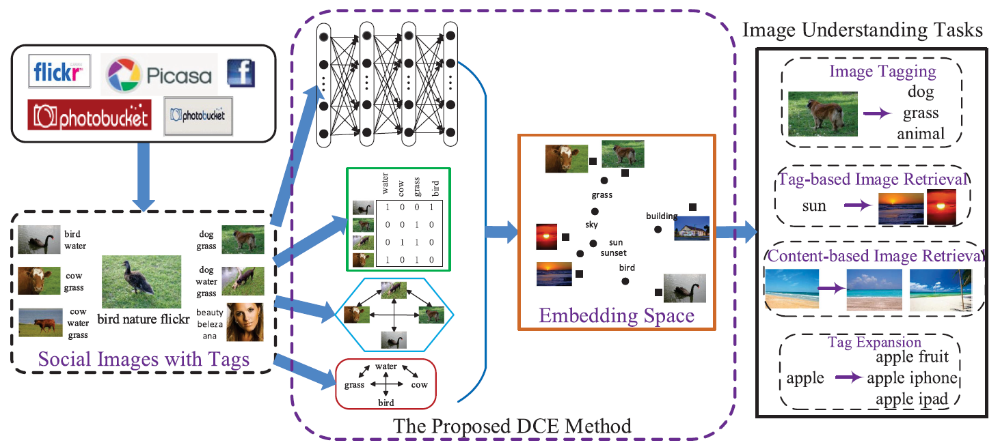

## 3 THE PROPOSED DCE FRAMEWORK

A novel weakly supervised deep embedding model under the matrix factorization framework for collaborative social image understanding, called Deep Collaborative Embedding,

> [markdown编辑公式](<https://www.cnblogs.com/q735613050/p/7253073.html>)

对一个m维向量a计算 lq-norm(q>=1)
$$
||a||_q=(\sum_{i=1}^{m}{|a_i|^q})^{1/q}
$$

### 3.1 Preliminaries

包含n张社交图片的数据集 X: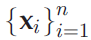

总共有c个标签：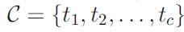

标签矩阵 **Y **= 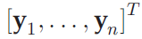   ，矩阵尺寸为 n x c

Yij=1 代表图片 xi 图片与标签 tj 相关，Yij=0 代表无关。

由于社交图片的标签都是用户标记的，有可能有标记错误、标记遗漏等原因导致的标签噪声问题。

为了解决标签噪声问题，得到一个精炼的矩阵 **F** ，同样是一个尺寸 n x c 的01矩阵。

<u>（到底是怎么把Y refine成F呢？）</u>

此外还有矩阵 **S** 代表图像间的相似性，矩阵 **C** 代表标签间的相似性。

使用矩阵分解方法（Matrix Factorization）将 **F** 分解成矩阵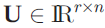 和 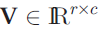

<u>（到底是怎么分解的？？）</u>

用Frobenius norm来度量分解的矩阵分解带来的误差，并加入正则化项避免过拟合

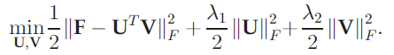

> Frobenius norm：矩阵A的Frobenius范数定义为矩阵A各项元素的绝对值平方的总和
>
> L2正则化就是在loss的计算中加上权重参数的平方和，惩罚参数过多或者过大，避免模型更加复杂，可以防止过拟合。

### 3.2 Basic Formulation

几个矩阵之间的关系图：

Y去除噪声得到F，F矩阵分解得到U和V，S=U[^T]U，C=V[^T]V

本文提出的模型目标函数为：

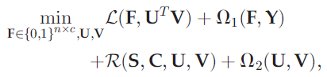

L 是损失函数，omiga是正则化项，用于防止过拟合。

函数R用于将visual structure和textual structure结合起来

解决标签噪声问题，将标签矩阵Y精炼成矩阵F，同时引入L1正则化：

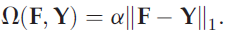

则模型优化公式可化为：

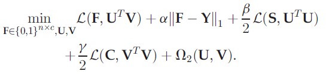

模型将图像的视觉信息和标签的文本信息联合起来一起训练，最终嵌入到同一个unified space中。由于引入了refined 标签矩阵F，模型对标签噪声robust。

模型训练后，得到矩阵U和V，可以计算得到两个矩阵S和C：

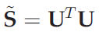 代表图像间的相似性

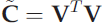 代表标签间的相似性

有了矩阵F、S、C就可以做image tagging, TBIR, CBIR and tag expansion等任务了。

但是仍未能很好的获取新图像和新标签的embedding，为了解决这个问题，提出了下面的方法

### 3.3 The End-to-End Learning

New image：

用CNN提取特征：假设CNN有 L 层，提取出来的特征为d维的hL(X)，则再经过一个权值矩阵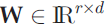的映射得到image的latent representation

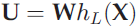

CNN是一个在ImageNet上预训练过的网络。

网络同时训练W,F,V，则训练完后对新图片x，可以这样计算他的latent representation

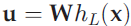

### 3.4 The Embedding of New Tags

New tag:

word2vector神经网络（预训练的skip-gram模型）。

学习一个映射函数g，将tag映射到一个dt维特征向量：（这个函数g是不是就是W2V矩阵？）

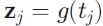

再经过一个权值矩阵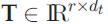映射得到tag的latent representation

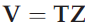

学习到矩阵T后，对新标签计算latent representation：

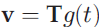

### 3.5 The Objective Function

将上述U、V矩阵的公式再带入模型目标函数中：

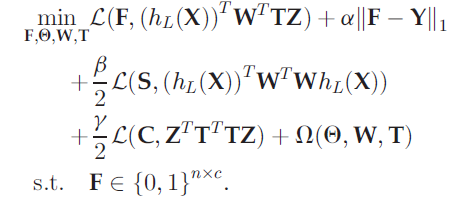

omiga还是正则化项，防止过拟合。

## 4 OPTIMIZATION

loss函数L选择最小平方差（least square loss）

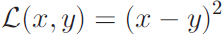

对于矩阵来说就是矩阵相减后求F-范数

>  Frobenius norm：矩阵A的Frobenius范数定义为矩阵A各项元素的绝对值平方的总和

则目标函数又化为：

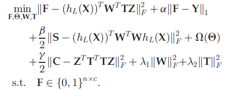

omiga(theta)的正则化类似于CNN网络中的dropout和BN，而矩阵W、T的正则化计算则还是用F-范数。

采用交替更新方法：

（1）CNN是预训练模型，固定CNN，求出并更新F、W、T

（2）用学习到的F、W、T对CNN进行fine-tuned

### 4.1 Solution for T

固定F、U，计算T的梯度并更新：

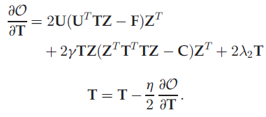

### 4.2 Solution forW

固定F、V，计算W的梯度并更新：

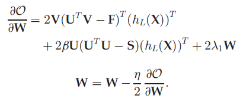

### 4.3 Solution for F

固定U、V更新F，矩阵F的优化问题如下：

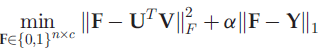

由于F是01矩阵，元素值是离散、非负的，需要引入一个辅助矩阵

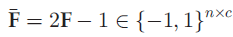

其实就是取值从{0,1}变成{-1,1}而已。

重写优化目标：

其中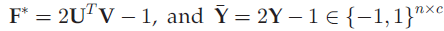

由于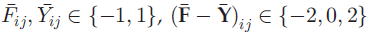

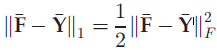

式子左右两边计算结果是相同的，都是取值{0, 2}，将L1 norm换成F-norm应该是因为更好求导。

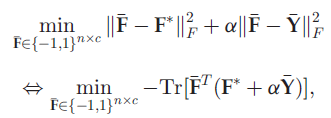

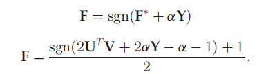

（我靠，这两个式子到底是怎么化的，彻底懵了）

### 4.4 Deep Network Fine-Tuning

模型训练算法流程

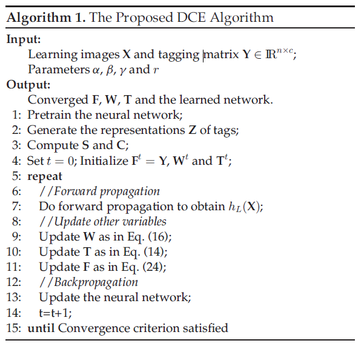

## 5 IMPLEMENTATIONS

### 5.1 Deep Neural Network

AlexNet trained on the ImageNet dataset.

图像经过AlexNet得到一个1000-dim的向量，再接一个全连接层得到一个embedding。

关于神经网络的正则化，就是使用dropout而已。

### 5.2 Image Similarity

图片之间的相似性矩阵S，即包含图片之间视觉层面的相似性Sv，又包含图片之间语义层面的相似性St，

通过优化函数同时获得这两种相似性

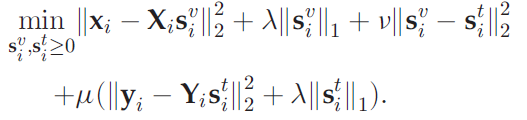

分别学习图片visual view和textual view特征的同时拉近它们两者的距离，然后还加入正则化项防止过拟合。

（其实不是很理解||xi-XiSiv||这个东西，难道是3x224x224？为什么要这么搞？太奇怪了）

最后再将这两个矩阵综合起来得到图像相似性矩阵  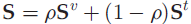

### 5.3 Tag Correlation

从local 和 global两个层面上寻找tag之间的相似性。

The local correlation represents relatively **precise** statistical characteristic but **depends on the learning data**

The global correlation is **universal and independent of any corpus** but may contain some **noise**.

nonnegative sparse reconstruction（非负稀疏重建）获取 local correlation

co-occurrence-based method 获取 global correlation

然后综合起来得到tag相似性矩阵  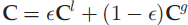

> What is reconstruction side? Also learning models can be formulated with a reconstruction cost functions where the idea is to find the most optimal representation of the given data and it is expected to be sparse. After you learn this representation you have a generative kind of model of your data and you might classify novel data with the comparison of reconstruction model (there are generic solutions like energy models, mostly used in deep learning methods.)

## 6 EXPERIMENTAL VALIDATION

Image understanding tasks

- image tagging
- tag-based image retrieval
- content-based image retrieval 
- tag expansion

### 6.1 Datasets

MIRFlickr 和 NUS-WIDE

MIRFlickr：25,000 images, 1,386 user-provided tags, 38 concepts。去除出现次数低于50次的tag，最后剩下457个tags和18个concepts。

> <http://press.liacs.nl/mirflickr/mirdownload.html>

NUS-WIDE：269,648 images,  5,018 tags。去除出现次数低于125次的tag，最后剩下3,137个tags和81个concepts。

> Ground-truth concept labels
>
> Each concept, represented by a few tags with high co-occurrences among themselves, is indexed as a textual document. Then user-given tags of an image is represented as a text query and the matching concepts are retrieved from the index. The candidate tags associated with the matching concepts are then recommended.
>
> 38个concepts相当于数据集给出的图片label，是ground-true。
>
> 1386个tags是用户标注的，是有噪声的。

由于图片标签是用户标注的，所以一般会有标记错误或者遗漏等噪声问题。

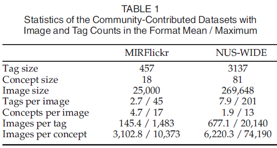

这图到底什么意思？？？还是看不懂，到时候不放这个图就是了。

### 6.2 Protocols

将数据集划分为learning data和testing data两部分。前者10,000张images，后者取剩下的images。保证learning data里包含所有labels。为了排除随机割分数据集的影响，重复实验5次，效果取平均。

参数设置：

- space dimension r ，用linear search方法调整，设为50。
- alpha, beta,gamma，用grid-search方法从下面数值中调整最好的参数组合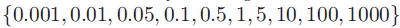
- lambda1=lambda2=0.005，经验调参

### 6.3 Image Tagging

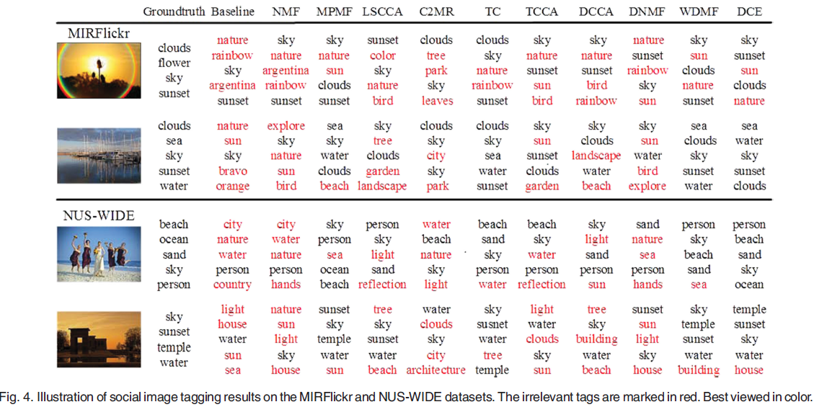

评估指标：**mean MicroAUC, mean MacroAUC and mean F1**

mean对应的是刚才说的5次实验，结果取平均。

Both the microaveraging and macroaveraging measures are adopted to evaluate the global performance across multiple concepts and the average performance of all the concepts.

the performance for image tagging is evaluated by using the F1 score. The mean F1 over concepts is reported.

> F1值是精确率和召回率的调和均值   F1=2PR/(P+R)
>
> TPR：在所有实际为Positive 的样本中，被正确地判断为Positive 的比率（与Recall
> 相同）。TPR=TP/(TP+FN)
> FPR：在所有实际为Negative 的样本中，被错误地判断为Positive 的比率。
> FPR=FP/(FP+TN)。
> 可见应该是TPR 越高越好，FPR 越低越好.
>
> 以TPR为y轴，FPR为x轴，调整阈值从0到1，画ROC曲线，曲线下面的面积为AUC值，AUC值越大说明模型效果越好。
>
> MicroAUC直接计算所有类别的指标，受小类效果影响小
>
> MacroAUC先分别计算各类的指标，再取平均。受小类效果影响大

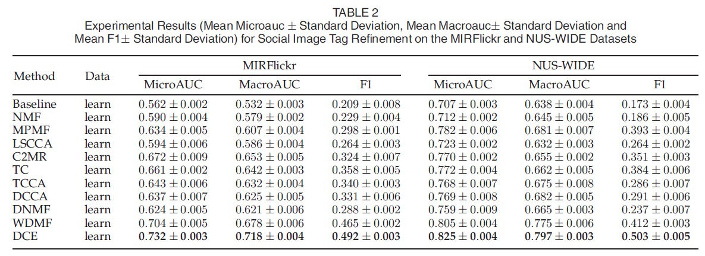

Recall指标， measure the percentage of correct tags tagged by the tagging methods out of all
ground-truth tags.  就是说（标记正确的标签总数/数据集的标签总数）

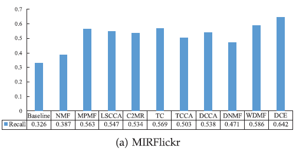

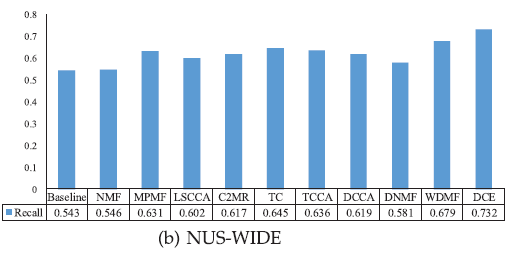

DCE模型的结果是最好的，证明了DCE模型的有效性。

DCE method achieves very encouraging results by introducing the refined tagging matrix, the end-to-end learning and collaborative factor analysis.

验证out-of-sample problem（assign tags to new images）的效果：就是说上面的实验是在learning data上做的，这个实验是在testing data上做的。

neighbor voting strategy

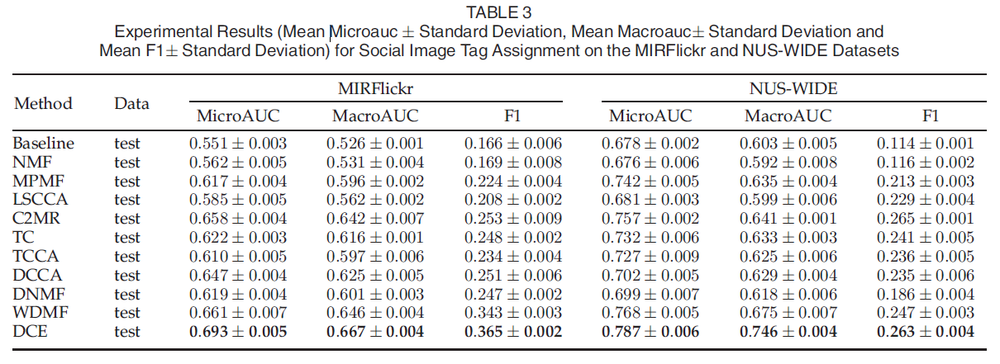

说明DCE可以处理给新图片上标签的问题，而且取得最好的效果。

下面的新标签求embedding问题建议不要管了。。。

testing data有新图片，自然就还有新标签，DCE可以学习新标签的embedding，而以上Baseline算法都无法处理new tags的问题，所以换为与WordNet-based correlation method 和 Google distance-based method作对比。

通过观察new tag与已有tag之间的语义联系，来得到它的representation。

Based on the obtained correlation pj between tu and the jth tag,the latent representation v of tu can be calculated：

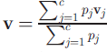

### 6.4 Tag-Based Image Retrieval

根据给出的一个标签来检索相关的图片。

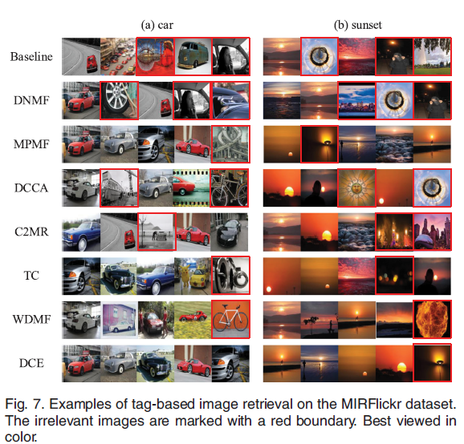

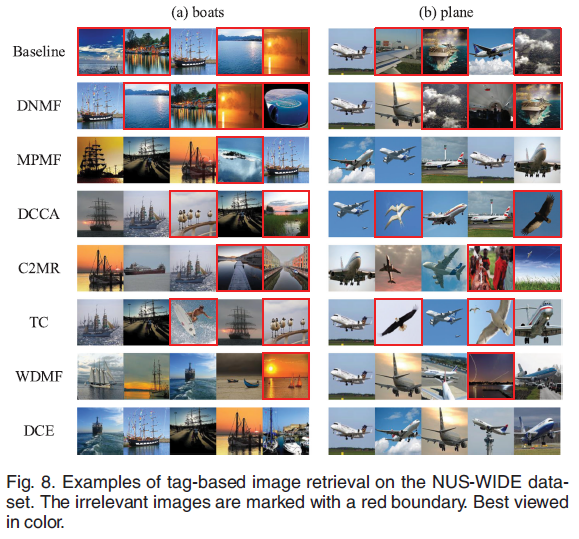

评估指标：

Mean Average Precision (MAP) over concepts is obtained by averaging AP over all concepts.

> 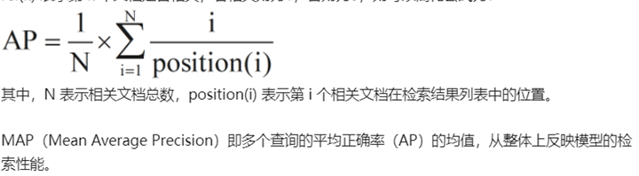

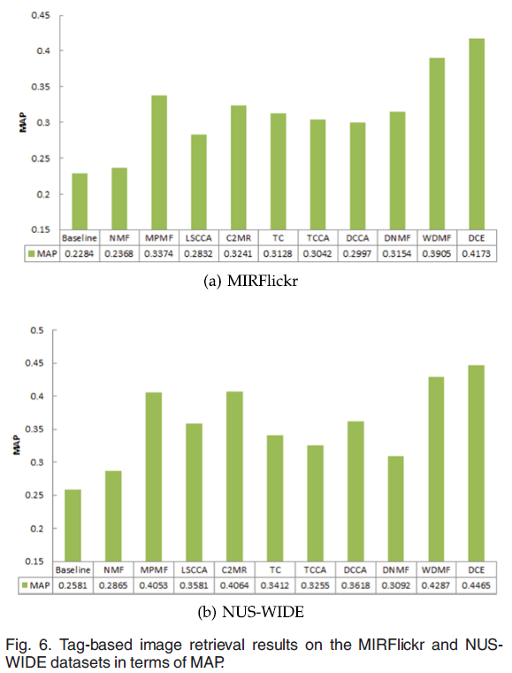

### 6.5 Content-Based Image Retrieval

DCE模型在学习到图片的latent representations后，就可以根据latent representations距离来判断图片间的相似性，进而进行基于图片内容的图像检索任务。

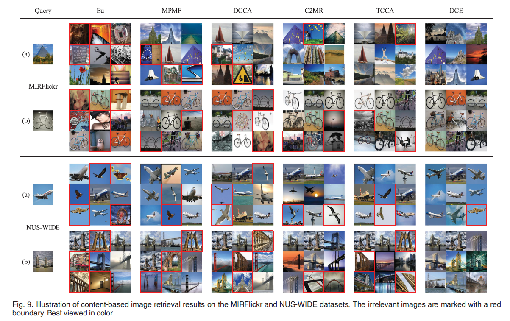

评估指标：NDCG@k

> **累计增益（CG）**：搜素结果相关性分数的总和,没有考虑到位置的因素。
>
> **折损累计增益（DCG）**：每一个搜索结果的相关性分数除以一个折损值，然后再求总和，位置越靠后折损值越大，目的是让排名靠前的结果对评估指标影响更大。
>
> 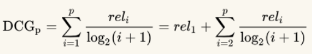
>
> **归一化折损累计增益（NDCG）**：不同检索词的搜索结果数不同，为了能够进行比较，要做归一化
>
> 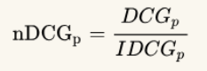
>
> 其中IDCGp为理性情况下最大的DCG值。
>
> 参考<https://www.cnblogs.com/by-dream/p/9403984.html>

DCE效果比其他模型要好，可能是它在提取latent feature的过程中不仅利用了图片本身的视觉信息，还利用到了图像标签文本的语义信息。

### 6.6 Tag Expansion

一个图片的tag可能不够全面详细，可以通过tag-to-tag retrieval来给图片扩充tag信息。

用user study来评估tag expansion的效果。

25个学生，5个老师

much better, better，worse 分别给分 3, 2, 1

## 7 CONCLUSION

在social image understanding任务上，提出了Deep Collaborative Embedding 模型。在一个模型上同时实现了end-to-end learning和collaborative factor analysis。从标签矩阵中学习refined matrix以及correlation matrices以更好的学习social images的语义信息。此外还提出了处理out-of-sample问题的方法。模型可适用于image tagging、tag-based image retrieval、content-based image retrieval、tag expansion等任务。实验结果证明了DCE模型的有效性，达到了SOTA效果。

> 相对于深度学习，传统机器学习的流程往往由多个独立的模块组成，比如在一个典型的自然语言处理（Natural Language Processing）问题中，包括分词、词性标注、句法分析、语义分析等多个独立步骤，每个步骤是一个独立的任务，其结果的好坏会影响到下一步骤，从而影响整个训练的结果，这是非端到端的。
>
> 而深度学习模型在训练过程中，从输入端（输入数据）到输出端会得到一个预测结果，与真实结果相比较会得到一个误差，这个误差会在模型中的每一层传递（反向传播），每一层的表示都会根据这个误差来做调整，直到模型收敛或达到预期的效果才结束，这是端到端的。