# Dual Encoding for Zero-Example Video Retrieval

 

Zero-example video retrieval ：文本搜无标签视频，输入只提供文本不提供视频样本

给定视频（帧序列）和查询语句（词序列），需要用到跨模型匹配的sequence-to-sequence模型

This paper proposes a dual deep encoding network that encodes videos and queries into powerful dense representations of their own.

 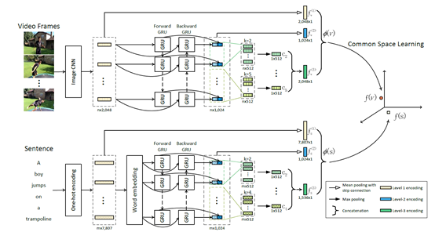

​                                                  

 本文贡献：

（1）提出了vedio和text的multi-level encoding（就是各个层的输出特征都利用起来）

（2）提出了一个新的dual network，以相似的模式编码视频输入和文本输入

（3）SOTA

 

模型将输入的vedio v和sentence s 分别编码为Ф(v) 和Ф(s) ，二者维度不同，要再做common space learning.

每个视频离线提取特征Ф(v)，而每个查询句子的特征提取和common space learning都是在线学习的。

 

## Video-side Multilevel Encoding

先介绍模型中Vedio方面的处理方法：

视频每0.5秒抽一帧，得到n个帧。

每个帧用预训练的ImageNet CNN提取特征，特征向量维度设为2048。（可用3D CNNs提取特征）

至此视频可用一个特征向量序列{v1,v1,…,vn}代表，其中vt代表第t个帧的特征向量

 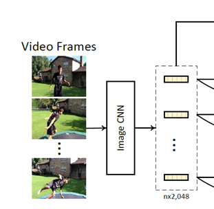

​    

 **Level 1. Global Encoding by Mean Pooling**

 就是简单的对特征向量序列的每个维度取平均值

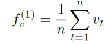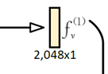

**Level 2. Temporal-Aware Encoding by biGRU**

   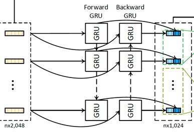

视频有时序特性（temporal characteristic），因此使用Bi-GRU，

包含两个GRU层：forward GRU和backword GRU

设正向和反向GRU的第t步的隐藏状态为（第t个帧对应的那个单元）

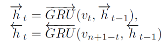

将他们拼接起来，得到双向GRU的输出特征向量

   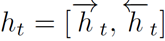

设置每层GRU的输出特征向量维度为512，则ht维度为1024

至此得到一个feature map H={h1,h2,…,hn}

 

同理用mean pooling，特征向量序列的每一个维度取平均值，得到这一层的特征：

​              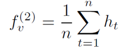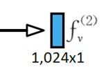

 

**Level 3. Local-Enhanced Encoding by biGRU-CNN**

   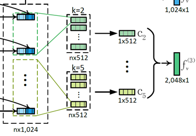

Bi-GRU层中每一帧对应的输出结果地位相同，为了更好的捕获局部特征，在Bi-GRU层后面接上一维CNN

设一维卷积核为   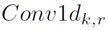，代表size=k，filter数为r=512

使用zero-padding，则卷积后得到一个大小为n*r的feature map

对feature map使用激活函数RELU，再使用max-pooling压缩feature map

   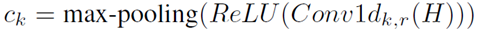

共设计了四种尺寸不同的卷积核，k=2,3,4,5

对应的输出Ck拼接起来得到biGRU-CNN的输出特征向量：

   

 

最后将这三个不同level的特征拼接起来得到vedio的multi-level特征向量：

   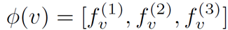

 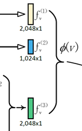

 

## Textside Multilevel Encoding

文本方面的处理：

   

设sentence s包含m个word，用one-hot向量代表每个word，得到one-hot向量序列：{w1,w2,…,wm}。每个向量维度为7807，即vocab中共有7807个单词。

类似于词袋模型表示方法，取平均得到   

   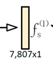

 

One-hot序列矩阵乘一个word embedding矩阵，将每个word转换为一个dense vector。用一个预训练的word2vec模型初始化word embedding矩阵

 

接下来的处理类似于vedio部分，得到剩余两个level的特征f，其中不同的是biGRU-CNN中只有三种不同的卷积核，k=2,3,4 .

最后得到sentence的multi-level特征

   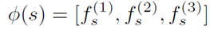

 

由于Ф(v) 和Ф(s)维度不同，无法直接比较，计算相似度，因此需要做common space learning

 

# common space learning

使用common space learning算法VSE++

目标：将Ф(v) 和Ф(s)映射到一个common space中

公式：

   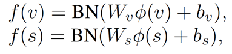

W是全连接矩阵，b是bias向量

BN是做批标准化

计算f(v)与f(s)之间的余弦相似度   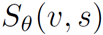，其中θ代表模型所有参数。

使用improved marginal ranking loss：

   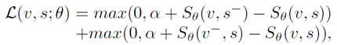

α是margin常量，  v- 代表sentence s的一个vedio负样本，s-同理。

 

The two negatives are not randomly sampled. Instead, the most similar yet negative sentence and video in the current mini-batch are chosen.（？？？）

 

 

实验部分：

MSR-VTT  text-to-vedio  和  vedio-to-text检索

MSVD    cross-dataset generalization

MPIIMD   cross-domain generalization.

Flickr30k   MS-COCO

 

 

## Related Knowledge

GRU

rnn

https://blog.csdn.net/zhaojc1995/article/details/80572098

lstm

https://www.jianshu.com/p/4b4701beba92

LSTM和GRU的动态图解

http://www.elecfans.com/d/804246.html

 

 

 