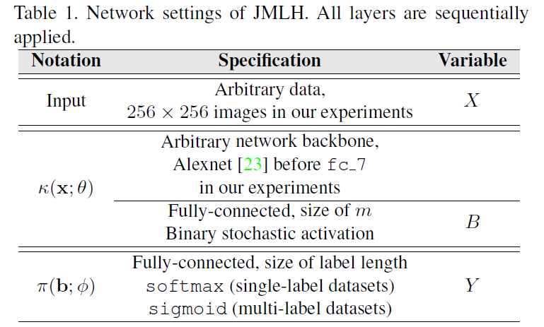
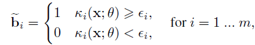
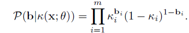
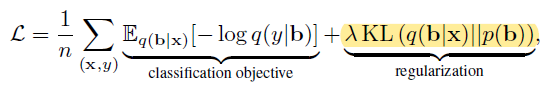
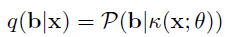
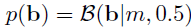

文章研究的是有监督的哈希检索任务。

## 模型结构

直接看模型结构：

m的大小是哈希码的长度。

模型从输入到输出，依次经过 AlexNet、全连接层（映射成m维实数向量）、随机编码层（把实数向量转变成离散向量）、全连接层（映射成维度大小为标签数的实数向量），最后再用来计算分类误差。

## 随机编码层

这里面最主要的点在于随机编码层，其实就是利用伯努利分布来把实数变量转变成离散值。其做法就是，对于每个实数值，生成一个取值范围为[0,1]的随机数，然后作为阈值来决定其转变的结果值为0还是1

这样的好处是可以通过伯努利分布的累乘公式来计算转变前后的相似性，从而达到可以进行反向传播的目的，以训练神经网络

上面公式的k是指实数向量，b是二进制向量。

## KL散度

下面是文章的误差公式

前面部分是分类误差，后面部分的KL散度的作用是保留部分的熵，作为一个正则化项来防止过拟合的情况。KL散度其实就是计算两个熵的差值。前面的部分其实就是一个实数值概率

即给定x的情况下，得出b的概率。而后面部分其实就是说

给定b的情况下，假设要构成b这个二进制向量（每一位为1或者0的概率是0.5），那么我构成b的概率是多少。（这里其实无论b是什么，概率都是0.5的m次方）。然后计算二者的熵值作为误差的一部分就相当于是让k去拟合这个每个位是0.5概率的情况。显然如果KL散度这部分的lambda参数值如果比较大的话，有可能k直接就变成一个全是0.5的实数向量而导致没法训练了，所以lambda应该十分谨慎，设置的比较小是比较好的。