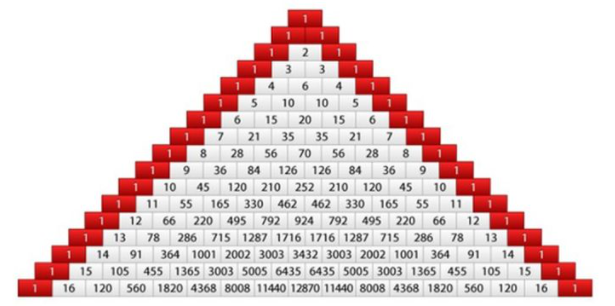
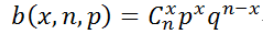
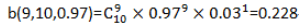

## 二项分布

参考 https://zhuanlan.zhihu.com/p/24692791

二项分布的一个典型场景是抛硬币，因为其满足以下条件：

1. 每次试验只可能出现两个结果
2. 每次试验都是相互独立，互不影响的

那么二项分布指的就是抛n次硬币后，所期望的结果（正面）的出现次数的概率。

n=1时，只有两种结果：正和反。正面出现次数1和0，则各自的出现概率是`0.5，0.5`；

n=2时，有三种结果：正正、正反和反反。正面出现次数有三种：2、1和0，各自的出现概率是`0.25，0.5，0.25`；

n=3时，有8种结果：正正正、正正反、正反正、正反反、反正正、反正反、反反正、反反反。正面出现次数有四种：3、2、1和0，各自的出现概率是`0.125、0.375、0.375、0.125`；

因此可以总结出二项分布的概率公式

其中b表示二项分布的概率，n表示试验次数，x表示出现某个结果的次数，C是组合。

举例子，检测10件产品，每件的合格率为0.97，求出10个样品中有9个合格品的概率多少。

那么在这里p=0.97，n=10，x=9，10个样品中有9个合格品的概率为

 

## 熵、KL散度、交叉熵

https://blog.csdn.net/weixin_41519463/article/details/114138927

