## Abatract

图片可分为高低频

高频：被编码为更多细节

低频：被编码为global structures

经卷积层所得的feature map也可分高低频

OctConv可直接代替卷积层而不需要调整网络中的其他结构

实验效果：提高准确率、降低内存、计算开销。

实验OctConv的ResNet-152网络有82.9%准确率，计算开销为22.2 GFLOPs

## 1. Introduction

近期的CNN研究通过降低模型参数和通道维数的冗余而提高效率，但feature map中spatial
dimension上仍有冗余，每个位置只存储自身的特征，忽视了相邻位置的特征信息，他们原本可以一起存储一起处理。

图1（a）空间频率可分为高低频，低频部分描述平稳变化的结构，高频部分描述急剧变化的结构
（b）经卷积层所得feature
map可被分为低频和高频部分（c）把低频部分用低分辨率的tensor来存储，即相邻的位置之间共享信息，以减少空间冗余程度。（d）OctConv分别更新高低频部分并支持两部分之间的信息交换。

一个octave单元的feature map包含两部分频率的张量，可直接提取low-frequency
map而不需要事先编码成高频。

OctConv比朴素Conv花费更少的内存和计算开销，OctConv使用低频卷积处理低频信息。OctConv专注于对feature
map进行分频和减少空间冗余，不同于现有算法专注于构建更好的CNN拓扑结构以减少feature
map上的通道数和模型参数的冗余。OctConv可以很容易地作为即插即用单元部署来替代Conv，而不需要改变网络架构或进行超参数调优。

实验表明用OctConv替换Conv后在2D CNN和3D CNN模型上得到了提升，Oct-ResNet-152
outperform state-of-the art。

贡献：

1.  提出讲feature
    maps分解成高低频组，分别使用对应的convolution进行处理，通过降低低频部分的分辨率，降低了内存和计算的开销。也使得每一层得到了更大的接受域以获取更多的上下文信息。

2.  OctConv即插即用，直接替代Conv。

3.  测试OctConv在多个CNN模型上的效果，在图像和视频任务上都取得效果提升。

## 2. Related work

AlexNet,VGGNet通过堆叠卷积层提高CNN效率，ResNet和DenseNet通过加入shortcut连接来增强特征重用机制、缓解最优化的困难。ResNeXt和ShuffleNet使用sparsely
connected group convolution来减少通道间连接的冗余，使得在相同的计算开销下能使用更深或更宽的网络。Xception 和 MobileNet。。。（略）

## 3. Method

### 3.1. Octave Feature Representation

Natrual image的低频信号获取global layout和coarse structure，高频部分获取细节信息，类似推算feature map也是如此，其低频部分包含了冗余信息。

Octave feature representation将feature map张量分为高频、低频两个组。根据尺度空间理论（？），定义octave为对空间维度除以2的幂，这里只考虑2^1。使用octave减少低频feature map的空间分辨率。

使用

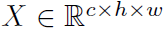

来代表卷积层的输入特征张量，h、w是空间维度大小，c是通道数。将X在通道维度上分解为
X = {XH,XL}，其中高频特征为

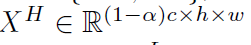

低频特征为

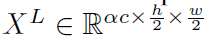

a∈ [0,1]代表低频特征占有通道数的比率，其中低频特征空间分辨率只有高频特征分辨率的一半。

### 3.2. Octave Convolution

由于空间分辨率不同，不能直接在高低频的特征表示上使用卷积操作，直接把XL上采样为原本的分辨率的做法是无意义的。Octave
Convolution可以直接对X={XH,XL}进行操作。

**Vanilla Convolution.：**

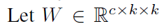

代表一个k\*k的卷积核（或者说filter），

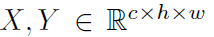

分别代表输入、输出tensor。

每个feature map上，Yp,q ∈Rc

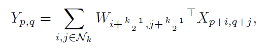

其中(p,q)代表位置坐标，

Nk=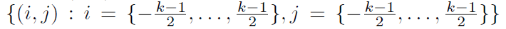

代表局部neighborhood。其实就是让W矩阵覆盖在X上，其中W的中心点( (k-1)/2 ,
(k-1)/2 )与坐标(p,q)对齐.

省略padding，假设k是奇数，输入、输出维度相同，即

其中Cin=Cout=c

**Octave Convolution：**

设X,Y是输入、输出张量，则Y={YH,YL}，其中

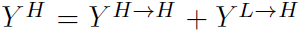

Y L = Y L→L +Y H→L ,

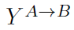

代表对group A进行卷积操作得到group B，

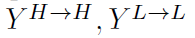

是频率内部信息更新，

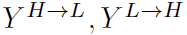

是频率间信息交流。

将卷积核W分解为

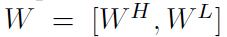

，分别用于对XH、XL进行卷积操作，各自还可以细分为频率内、频率间两部分：

WH =[WH→H,WL→H]，WL =[WL→L,WH→L]

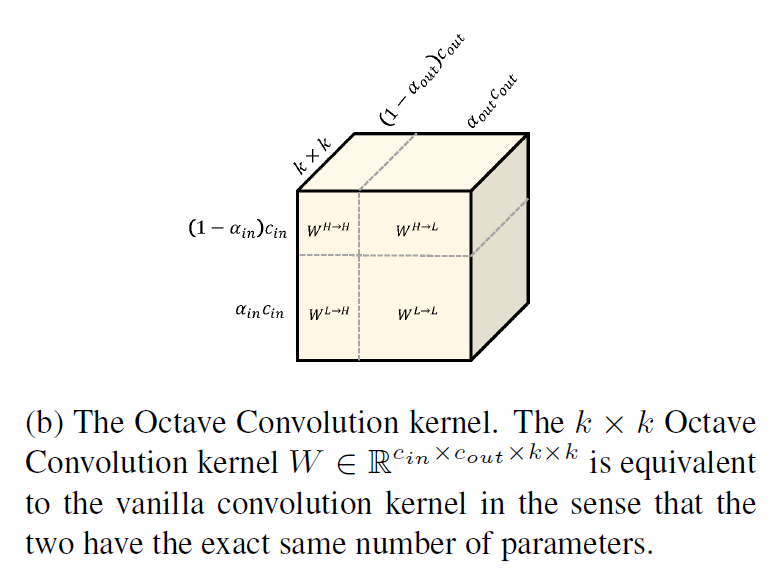

计算YH时，XH不用管，XL要做上采样

计算YL时，XL不用管，XH要做下采样

对于高频feature map，使用传统Conv进行频率内的更新，对于高低频之间的交流，则fold
the up-sampling over the feature tensor XL into the
convolution，这样就不需要显式计算和存储 上采样的feature maps：

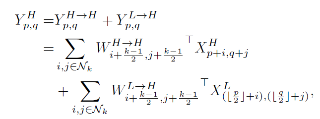

对于低频feature map，频率内也是使用传统Conv更新，对于高低频之间的交流，

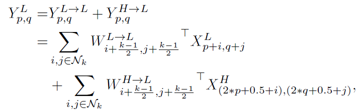

通过给坐标(p,q)乘以2来进行下采样，further shifting the location by half
step是为了保证下采样后的map于input匹配。

XH的索引只能是整数，因此可以设置索引位置为(2\*p+I, 2\*q+j)或者取(2\*p+0.5+I,
2\*q+0.5+j)，即去4个临近位置的平均值。

前者也叫strided convolution。会导致misalignment。

后者叫average pooling，本文使用average pooling

OctConv Convolution的一个性质是低频feature map有更大的receptive
field。使用k\*k卷积核对低频部分XL进行卷积，能得到的receptive
field是vanllia卷积所得receptive
field的两倍。有助于OctConv层获得更多的上下文信息且潜在地提高识别效果。

### 3.3. Implementation Details

*i.e.：换句话说*

不用strided convolution的原因：

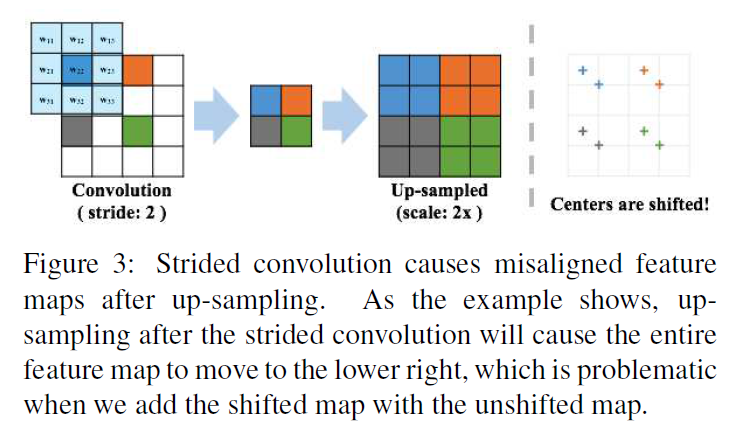

使用average pooling进行下采样来重写输出：

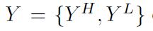

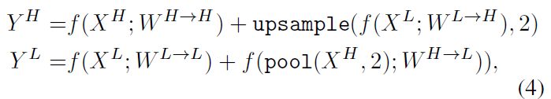

f(X;W)代表卷积操作，pool(X, k)代表使用卷积核k\*k和步长k做average
pooling，upsample(X, k)代表通过最邻近内插法进行参数为k的上采样操作。

OctConv的实现方法如下：

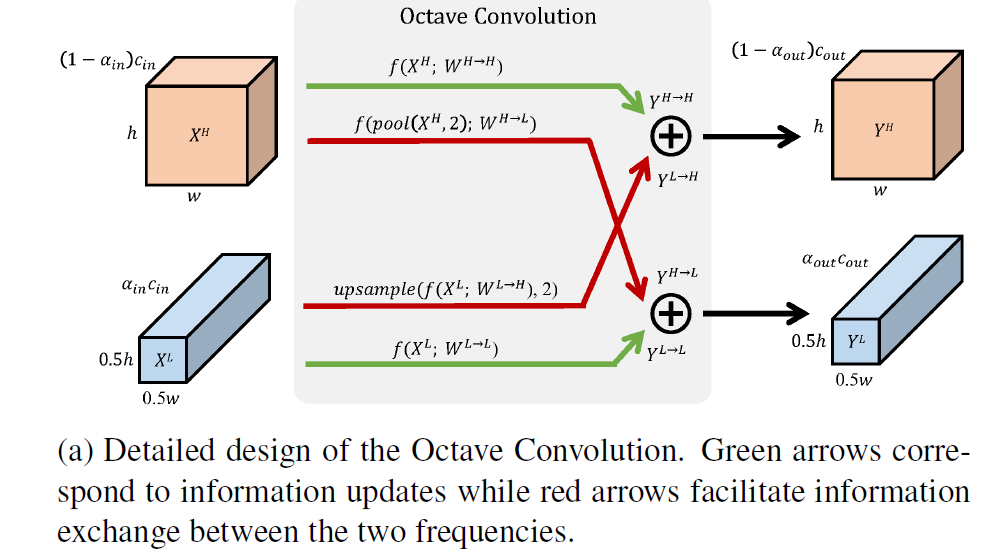

Group and Depth-wise convolutions.

Efficiency analysis.

Integrating OctConv into backbone networks.

## supplement

上采样：通过插值放大图片，下采样：通过取区域平均值缩小图片
http://www.cnblogs.com/fangpengchengbupter/p/7677707.html

receptive field，感受野：在CNN中，第n层特征图中一个像素，对应第1层（输入图像）的像素数，即为该层的Receptive Field，简称RF。神经元感受野的值越大表示其能接触到的原始图像范围就越大，也意味着它可能蕴含更为全局，语义层次更高的特征；相反，值越小则表示其所包含的特征越趋向局部和细节。因此感受野的值可以用来大致判断每一层的抽象层次。https://www.jianshu.com/p/2b968e7a1715

Nearest Neighbor（最近邻点插值法）：就是令变换后像素的灰度值等于距它最近的输入像素的灰度值

group convolution（分组卷积）：把feature maps分给多个GPU分别进行处理，最后把多个GPU的结果进行融合。我们假设上一层的feature map总共有N个，即通道数channel=N，也就是说上一层有N个卷积核。再假设群卷积的群数目M。那么该群卷积层的操作就是，先将channel分成M份。每一个group对应N/M个channel，与之独立连接。然后各个group卷积完成后将输出叠在一起（concatenate），作为这一层的输出channel。
depth-wise convolution：首先对每一个通道进行各自的卷积操作，有多少个通道就有多少个过滤器。得到新的通道feature maps之后，这时再对这批新的通道feature maps进行标准的1×1跨通道卷积操作。

ablation study. 模型简化测试。 
看看取消掉一些模块后性能有没有影响。 
根据奥卡姆剃刀法则，简单和复杂的方法能达到一样的效果，那么简单的方法更可靠。 实际上ablation study就是为了研究模型中所提出的一些结构是否有效而设计的实验。 比如你提出了某某结构，但是要想确定这个结构是否有利于最终的效果，那就要将去掉该结构的网络与加上该结构的网络所得到的结果进行对比，这就是ablation study

