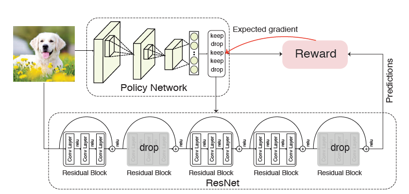
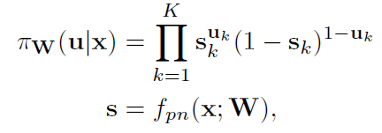
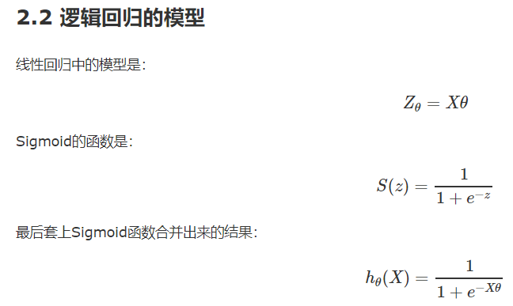
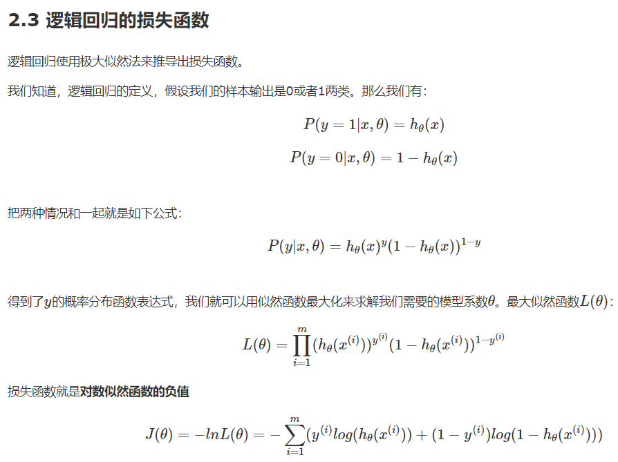
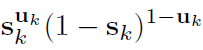

根据BlockDrop中的policy gradient写的。

策略函数为：

##  策略梯度网络结构

- 输入结点为一张图片
- 网络结构为CNN
- 输出层维度一般是动作的数量，其值再经过softmax函数处理变为采取各个动作的概率值

##  策略梯度网络权重的更新

神经网络都是根据误差函数来进行更新，而从严格意义上来讲，策略梯度算法是没有误差的，因为其输出只是选择动作的概率值。为了进行权重更新，我们将选取的动作的概率乘以一个变量作为损失函数，而该变量的取值取决于该动作的奖励收益。
训练目标为损失函数最大化，这样就可以学习使奖励收益越来越大，而选取合适动作的概率也越来越大。

在BlockDrop中，可以认为01向量 u 其实就是一个动作。每个维度元素值要么选1，代表keep对应的block，要么选0，代表drop对应的block。最后组成的 u 就决定了对这 K 个blocks的keep和drop的策略。那么策略函数计算的，就是在给定输入图片 x 的情况下，得到当前这个策略 u 的概率。然后拿这个概率乘以它的 reward，再加处理作为损失函数。

那么如何计算“给定输入x和网络参数W的情况下选择策略u的概率”呢？BlockDrop里用到的是逻辑回归中的似然函数，专门为二元分布设计的，参考[逻辑回归](https://www.cnblogs.com/huangyc/p/9813891.html)。

可见BlockDrop中其实就是把 u 向量当做ground-true label，把 s 向量当做probability。

似然函数 **P(u|x,W) =** 代表给定输入 x 和参数为W的情况下，取 uk 的概率。

然后用最大似然函数来衡量：在给定输入 x 和参数为W的情况下，取 u 的概率。

