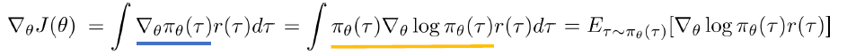
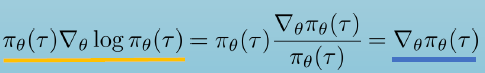
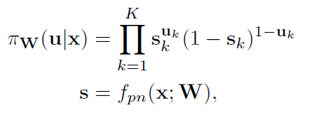

# Policy Gradient

参考[浅谈*Policy* *Gradient*](https://zhuanlan.zhihu.com/p/42055115)       [BlockDrop论文](https://arxiv.org/pdf/1711.08393.pdf)

如果github看不到公式，参考[github中的markdown无法显示公式解决办法](https://blog.csdn.net/u014568072/article/details/88872404)

## **1. 什么是Policy**

强化学习的基本结构：

- *Agent*通过观察当前环境的状态 ![[公式]](https://www.zhihu.com/equation?tex=s_t) ，得出当前应当执行的动作 ![[公式]](https://www.zhihu.com/equation?tex=a_t+)。

- Agent执行完动作之后环境对应发生了改变，并且环境会给予*Agent*一个反馈*reward* ![[公式]](https://www.zhihu.com/equation?tex=r_t)。
- Agent通过Policy Gradient更新。
- 此时又会是一个新的环境状态 ![[公式]](https://www.zhihu.com/equation?tex=s%27)，基于本次的环境状态，*Agent*又会执行对应的动作，得到新的reward。

以此类推持续进行下去，直到结束。

**Policy**就是在不同的状态（state）下决定采取什么样的动作（action），**Policy**常用符号 ![[公式]](https://www.zhihu.com/equation?tex=%5Cpi) 来表示。在Deep Reinforcement learning中经常用神经网络作为Policy network。

***

**BlockDrop：**

- 向Policy Network输入当前图片 x，得到概率分布向量 s ，使用伯努利分布根据 s 得到01向量policy，这个policy向量决定ResNet的每个blocks是keep还是drop，action就相当于是keep、drop这两个动作。
- 根据policy向量对ResNet的blocks进行keep或drop后，将图片输入这个ResNet，得到prediction，根据prediction和reward计算公式得到一个reward。
- 根据reward、![[公式]](https://www.zhihu.com/equation?tex=%5Cpi)公式计算Gradient，然后更新Policy Network。

新一轮循环，直到达到epoch上限。

## **2. 应该怎样进行梯度下降**

Policy Gradient就是基于我们的策略*Policy*来做梯度下降从而优化我们的模型。我们希望Agent能够尽量能够执行较好的动作。那么我们会使用执行了**该动作后得到的反馈reward来判定本次的策略好坏**。**然后训练我们的Agent倾向于做出那些reward较高的动作。**

## **3. 用监督学习的角度看策略梯度下降**

在监督学习中，我们会使用交叉熵来比较两个分布的差异。进而使用梯度下降法来逼近我们想要的梯度。

![[公式]](https://www.zhihu.com/equation?tex=H%28p%2C+q%29+%3D+-%5Csum_%7Bx%7Dp%28x%29+%5Clog+q%28x%29) 。其中 ![[公式]](https://www.zhihu.com/equation?tex=p%28x%29) 为对应的标签， ![[公式]](https://www.zhihu.com/equation?tex=q%28x%29) 则为输出的概率。

然而，在强化学习中，是没有对应的label的。那么我们怎么进行优化呢？这种情况就要用到reward。

比如在游戏中，多次运行Agent，Agent会基于概率而**采样**选择不同的策略。假设一次状态行为序列为 ![[公式]](https://www.zhihu.com/equation?tex=%5Ctau+%3D+%5C%7B+s_1%2C+a_1%2C+r_1%2C+s_2%2C+...%2C+s_t%2C+a_t%5C%7D) ，其中 ![[公式]](https://www.zhihu.com/equation?tex=s_t) 表示位于t时刻的状态， ![[公式]](https://www.zhihu.com/equation?tex=a_t+) 代表位于时刻t时候所作出的动作。

基于不同的动作策略，我们会得到不同*reward* ![[公式]](https://www.zhihu.com/equation?tex=R%28%5Ctau%29) 。假设运行得到比较好的分数得到了+3分，一般的分数得到了+1分，比较差的结果则得到了-1分。那么这个时候我们将会希望得到尽可能往+3分的结果，而-1分的则要尽量去避免。

## 4. 详解Gradient部分

参考[深度增强学习之*Policy* *Gradient*方法1](https://zhuanlan.zhihu.com/p/21725498)

要使用梯度下降的方法来更新Policy Network，我们需要有一个目标函数。目标就是期望reward，但是reward是环境给出的，应该如何利用这个目标来更新网络呢？

> BlockDrop中，reward是与Policy Network没有直接关联的，因为Policy Network生成了01向量policy，然后根据policy来决定block的keep or drop（这一步没有公式将他们关联起来），再使用ResNet生成预测，然后再计算reward。所以说无法直接把reward作为损失函数，单用reward无法更新Policy Network的参数。

这时候就想到了action的出现概率。一个Policy Network，输入state，输出action的概率。然后执行完action之后，我们可以得到reward。我们可以通过改变动作的出现概率来优化策略：

- 如果某一个动作得到的reward多，那么我们就使其出现的概率增大
- 如果某一个动作得到的reward少，那么我们就使其出现的概率减小。

***

下面的推导过程，详细讲解了期望reward、期望reward的梯度、为什么要这样设计损失函数等细节。

> 参考[Markdown中如何添加特殊符号](https://blog.csdn.net/u012569975/article/details/82557500)          [cs294_2017_policy_gradient](http://rail.eecs.berkeley.edu/deeprlcourse-fa17/f17docs/lecture_4_policy_gradient.pdf)

期望reward为：
$$
J=\int R(\tau)\pi_\theta(\tau)
$$
求导得：

蓝色下划线变化到黄色下划线部分参考公式：

由于不可能列举所有的可能性再取积分，因此可以化成N个可能性求和的形式：
$$
\nabla J=\int \pi_\theta (\tau)\nabla log	\pi_\theta(\tau)r(\tau)d\tau=\frac{1}{N}\sum R(\tau)\nabla log	\pi_\theta(\tau) \\
L(\theta)=-\frac{1}{N}\sum  R(\tau)log	\pi_\theta(\tau) 
\\\nabla L(\theta)=-\frac{1}{N}\sum R(\tau)\nabla log	\pi_\theta(\tau)=-\nabla J
$$
可见对loss反向传播更新进行梯度下降时，相当于对期望reward进行梯度上升，使期望reward变得更大。

通过降低loss使期望reward上升，每次反向传播都更新Policy  Network使得reward高的action的出现概率更大。

可以看到如何确定这个评价指标reward才是实现Policy Gradient方法的关键所在。（我觉得PI函数也很难设计）

***

所以我们会使用如下的式子做为损失函数进行计算：

![[公式]](https://www.zhihu.com/equation?tex=L%28%5Ctheta%29+%3D+-%5Cfrac%7B1%7D%7BN%7D%5Csum_%7B%5Ctau%7DR%28%5Ctau%29+%5Clog+%5Cpi_%5Ctheta%28%5Ctau%29) ，其中 ![[公式]](https://www.zhihu.com/equation?tex=%5Cpi_%5Ctheta%28%5Ctau%29) 表示采取 ![[公式]](https://www.zhihu.com/equation?tex=%5Ctau) 策略的发生概率，N为采样 ![[公式]](https://www.zhihu.com/equation?tex=%5Ctau) 的数目。

我们将其展开为假设情况有：

![[公式]](https://www.zhihu.com/equation?tex=L%28%5Ctheta%29+%3D+-%5Cfrac%7B1%7D%7BN%7D%5Csum_%7B%5Ctau%7DR%28%5Ctau%29+%5Clog+%5Cpi_%5Ctheta%28%5Ctau%29+%3D+-%5Cfrac%7B1%7D%7B3%7D%5Cleft%5B3+%2A+%5Clog+%5Cpi_%5Ctheta%28%5Ctau_1%29+%2B+1+%2A+%5Clog+%5Cpi_%5Ctheta%28%5Ctau_2%29+%2B+%28-1%29+%2A+%5Clog+%5Cpi_%5Ctheta%28%5Ctau_3%29+%5Cright%5D+) 

相比交叉熵的梯度下降，这里实际上就相当于在出现的概率上加了一个reward系数。什么意思呢，直观上来讲，可以看做**多训练几下**。因为如果返回的reward为正的，那么会倾向于多训练几次这个过程，也可以视为向这个梯度方向多走几步，增加这种策略出现的概率。而如果reward结果为负的，那么则可视为向原本这个梯度方向的反方向走几步，以后也就尽量减少这种策略出现的概率。

***

**BlockDrop：**

与一般的Policy Gradient方法不同，对于一个样本它不会重复多次运行Agent（Policy Network）得到多个action和reward。这里对于一个样本，只会运行一次Agent，得到一个action（policy向量决定block的keep or drop）和一个reward。样本预测正确的情况下，reward是正数（取值[0,1]），且drop的blocks越多，reward越大；样本预测错误的情况下，reward是负数，reward= - gamma，gamma是一个惩罚系数。

损失函数也是用的Policy Gradient同样的损失函数：

![[公式]](https://www.zhihu.com/equation?tex=L%28%5Ctheta%29+%3D+-%5Cfrac%7B1%7D%7BN%7D%5Csum_%7B%5Ctau%7DR%28%5Ctau%29+%5Clog+%5Cpi_%5Ctheta%28%5Ctau%29)，其中 ![[公式]](https://www.zhihu.com/equation?tex=%5Cpi_%5Ctheta%28%5Ctau%29) 表示采取 ![[公式]](https://www.zhihu.com/equation?tex=%5Ctau) 策略的发生概率，N为采样 ![[公式]](https://www.zhihu.com/equation?tex=%5Ctau) 的数目。

对其稍作改变，就是BlockDrop的损失函数：
$$
J=R(u)\pi_\theta(u|x)\\ 
\nabla J=R(u)\nabla log	\pi_\theta(u|x)\\
L(\theta)=-R(u) log	\pi_\theta(u|x)\\
\nabla L(\theta)=-R(u)\nabla log\pi_\theta(u|x)=-\nabla J
$$
J 是期望reward，loss在深度学习框架中自动反向传播让loss下降，相当于让期望reward J 上升。

为什么这样设置PI函数就可以代表给定图片x的情况下采取u的概率呢？

假如s=[0.8, 0.1, 0.7], u1=[1, 0, 1]，u2=[0, 1, 0 ]那么
$$
\pi(u1|x)=0.8*(1-0.1)*0.7=0.503\\ 
\pi(u2|x)=(1-0.8)*0.1*(1-0.7)=0.006
$$
s是x经过policy network后输出的实数向量，s经过伯努利分布处理后变成01向量u。所以函数PI就是度量给定x的情况下，经过Policy network和伯努利分布处理后得到u的概率。

## **5. 关于每次动作的反馈**

上面讲的reward来自于一次完整的动作叠加得到，即经历了一次完整的状态-行为序列后得到的

![[公式]](https://www.zhihu.com/equation?tex=R%28%5Ctau%29+%3D+%5Csum_%7Bt%3D0%7D%5E%7BH%7D%7Br%28s_t%2C+a_t%29%7D)

因为往往在一系列动作执行完后才知道结果（比如下围棋）。假如一盘游戏输了，那么我们就会全盘否定掉本次游戏中所做的所有操作，一些好的操作也被相应地被否定掉了。但是只要采样足够多，好的操作就会更多的被肯定，最后还是得到正反馈。

## **6. 蒙特卡洛方法**

蒙特卡洛方法目的是使采样更充分，原理和过程很难，先不看。

