## RNN

参考https://blog.csdn.net/zhaojc1995/article/details/80572098

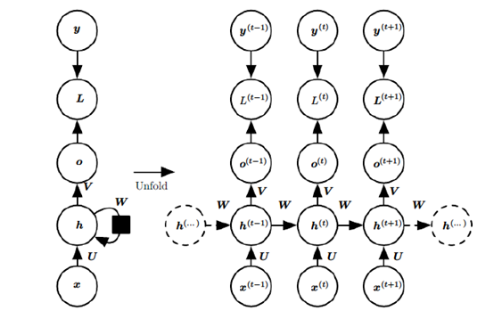                                                  

 

   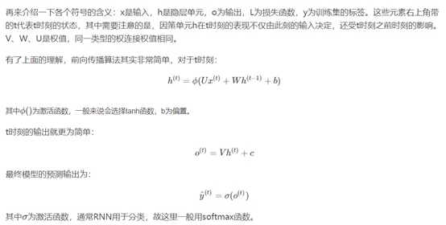

 

## LSTM

参考https://www.jianshu.com/p/4b4701beba92

rnn：

   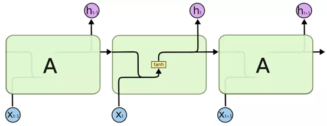

lstm：

   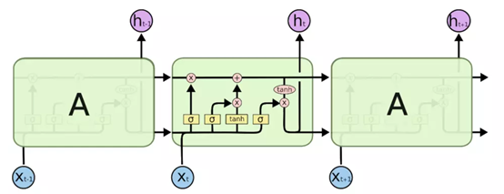

 

   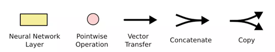

LSTM的关键是细胞状态，表示细胞状态的这条线水平的穿过图的顶部。

细胞的状态类似于输送带，细胞的状态在整个链上运行，只有一些小的线性操作作用其上，信息很容易保持不变的流过整个链。

   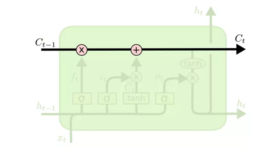

 

 

LSTM确实具有删除或添加信息到细胞状态的能力，这个能力是由被称为门(Gate)的结构所赋予的。

门(Gate)是一种可选地让信息通过的方式。 它由一个Sigmoid神经网络层和一个点乘法运算组成。

 

Sigmoid神经网络层输出0和1之间的数字，这个数字描述每个组件有多少信息可以通过， 0表示不通过任何信息，1表示全部通过

LSTM有三个门（输入门，遗忘门，输出门），用于保护和控制细胞的状态。

（1）遗忘门：

   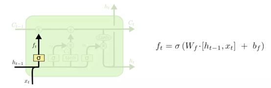

决定要从细胞状态中丢弃什么信息。 该决定由被称为“忘记门”的Sigmoid层实现。它查看ht-1(前一个输出)和xt(当前输入)，并为单元格状态Ct-1(上一个状态)中的每个数字输出0和1之间的数字。1代表完全保留，而0代表彻底删除。

 

（2）输入门：

   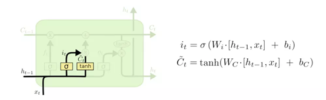

决定要在细胞状态中存储什么信息。 这部分分为两步。 首先，称为“输入门层”的Sigmoid层决定了将更新哪些值。 接下来一个tanh层创建候选向量Ct,该向量将会被加到细胞的状态中。 在下一步中，我们将结合这两个向量来创建更新值。

现在是时候去更新上一个状态值Ct−1了，将其更新为Ct。

   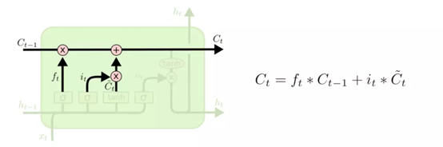

我们将上一个状态值乘以ft（遗忘门的输出sigmoid值），以此表达期待忘记的部分。之后我们将得到的值加上 it∗C̃ t。这个得到的是新的候选值， 按照我们决定更新每个状态值的多少来衡量.

 

（3）输出门：

   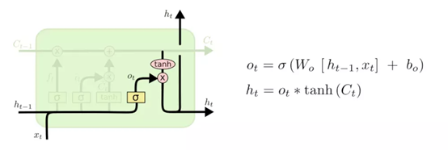

决定要输出什么。 此输出将基于我们的细胞状态，但将是一个过滤版本。 首先，运行一个sigmoid层，它决定了要输出的细胞状态的哪些部分。 然后，将单元格状态Ct 通过tanh（将值规范化到-1和1之间），并将其乘以Sigmoid门的输出，至此我们只输出了我们决定的那些部分。

 

 

 

 

#### Reference

RNN&LSTM https://blog.csdn.net/mzpmzk/article/details/80548927

异步的序列到序列的模式（N VS M） 

  这种 N vs M 的结构又叫 Encoder-Decoder 模型，也可称之为 Seq2Seq 模型。原始的 N vs N RNN 要求序列等长，然而我们遇到的大部分问题序列都是不等长的，如机器翻译中，源语言和目标语言的句子往往并没有相同的长度。Encoder-Decoder 模型可以有效的建模输入序列和输出序列不等长的问题

 

RNN处理时间序列数据，可以利用前后的依赖关系。

LSTM改进了RNN中反向传播时的梯度消失和梯度爆炸问题（通过引入遗忘门、输入门、输出门）

Lstm详细讲解，包括反向传播求导：https://zybuluo.com/hanbingtao/note/581764

Tramsformer模型（加入attention注意力）：https://blog.csdn.net/u012526436/article/details/86295971

 

[LSTM和GRU的动态图解](https://www.baidu.com/link?url=5SFdQizQNA1zLIXLE6Lcv9COb5aPz9hieGOveOeLFXWRQIkqFd5qmrjJQWdDLdIF&ck=8628.31.39253.0.0.500.271.0&shh=www.baidu.com&wd=&eqid=e04feaf6000671b6000000065cef8892) http://www.elecfans.com/d/804246.html

 

 

## GRU
https://www.cnblogs.com/jiangxinyang/p/9376021.html

GRU是LSTM网络的一种效果很好的变体，它较LSTM网络的结构更加简单，而且效果也很好

在LSTM中引入了三个门函数：输入门、遗忘门和输出门来控制输入值、记忆值和输出值。而在GRU模型中只有两个门：分别是更新门和重置门

图中的zt和rt分别表示更新门和重置门。

更新门zt用于控制前一时刻的状态信息被带入到当前状态中的程度，更新门的值越大说明前一时刻的状态信息带入越多。

重置门rt控制前一状态有多少信息被写入到当前的候选集 h~t 上，重置门越小，前一状态的信息被写入的越少。

 

前向传播：

   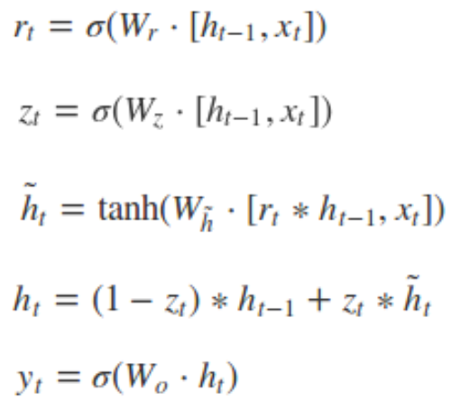

 

## Attention注意力模型：

https://blog.csdn.net/malefactor/article/details/78767781

Attention机制的本质来自于人类视觉注意力机制。核心目标是从众多信息中选择出对当前任务目标更关键的信息。

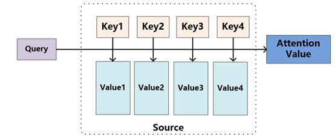

   

 

将Source中的构成元素想象成是由一系列的<Key,Value>数据对构成，此时给定Target中的某个元素Query，通过计算Query和各个Key的相似性或者相关性，得到每个Key对应Value的权重系数，然后对Value进行加权求和，即得到了最终的Attention数值。

所以本质上Attention机制是对Source中元素的Value值进行加权求和，而Query和Key用来计算对应Value的权重系数。即可以将其本质思想改写为如下公式：

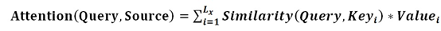

其中，Lx=||Source||代表Source的长度

有时Key=Value (比如机器翻译任务中)

 

Attention涉及两个Sentence，输入Source和输出Target

Self-Attention只涉及一个Sentence，Source=Target

 

 

 