Bert模型的准备知识：Transformer

Transformer是谷歌在17年做机器翻译任务的“Attention is all you need”的论文中提出的，引起了相当大的反响，很多研究已经证明了Transformer提取特征的能力是要远强于LSTM的。

Transformer模型：

https://blog.csdn.net/qq_41664845/article/details/84969266

https://zhuanlan.zhihu.com/p/48508221

以使用Transformer做机器翻译任务为例：

**一、模型结构**

Transformer仅由self-Attenion和Feed Forward Neural Network组成。不使用RNN（LSTM）因为RNN只能从左到右或者从右到左依次计算，限制了并行能力且有长期依赖。Attention机制可以解决以上问题。

蓝框内是Transformer模型

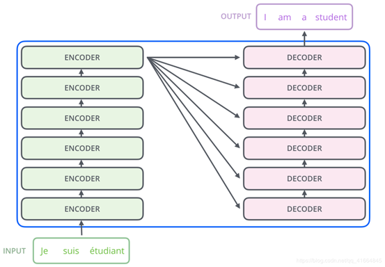

Encoder内部结构：（Encoder间不共享权值）

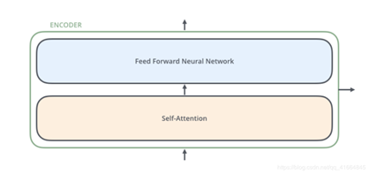

输入信息先后经过一个Self-Attention层和一个全连接的前馈神经网络。

Self-attention的作用是当考虑某一个单词时，将其上下文所有单词都纳入考虑，且不同单词赋予不同的权重。

 

Decoder内部结构类似，但中间多了一个Encoder-Decoder Attention层，（帮助Decoder专注于与输入句子中对应的那个单词（类似与[seq2seq models](https://jalammar.github.io/visualizing-neural-machine-translation-mechanics-of-seq2seq-models-with-attention/)的结构）

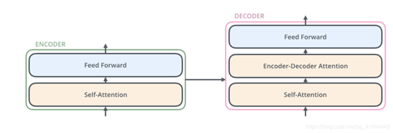

**二、Encoder部分**

Word embedding：https://blog.csdn.net/qq_41664845/article/details/84313419（十分详细，very good）

先对输入文本的单词做word embedding（维度设为512）:

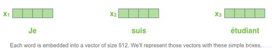

然后将他们输入到Encoder中：

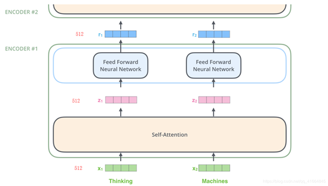

 当模型处理单词的时候，Self-attention层考虑到了所有上下文单词，全连接层只考虑当前单词对应的向量。self attention层可以通过当前单词去查看其输入序列中的其他单词，以此来寻找编码这个单词更好的线索。

 

 

Self-attention计算方式：

 

用三个矩阵WQ,WK,WV乘embedding向量得到query,key,value三个向量

（设这三个向量维度都为64）

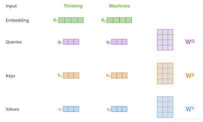

 

当前单词的query向量与所有单词的key向量做内积，接着如图计算得到attention权重，再与所有单词的value向量做加权求和运算，得到的Z向量就是经过self-attention层后这个单词对应的输出。

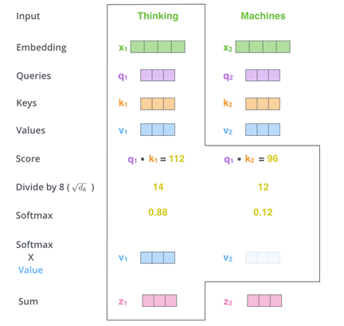

上诉计算过程：

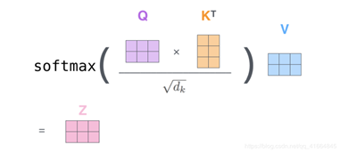

Multi-headed self-attention

有多组Query / Key / Value权重矩阵（Transformer使用8个attention heads，就是8组矩阵）不同的head学习不同的语义关系，分别做self attention计算，将得到的Z输出向量拼接起来，然后乘一个矩阵Wo压缩：

 

上述的attention计算没有考虑到单词的位置信息，即使把单词顺序打乱，每个单词经过self-attention层后的输出向量都是没有变化的。就是说对于一个单词，判断同序列中的另一个单词的attention权重时，只考虑了二者的语义联系，而没有考虑二者的位置关系。

因此transformer用word embedding + position embedding作为模型输入。（position embedding不需要训练，它有一个规则的产生方式）

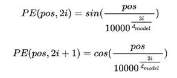

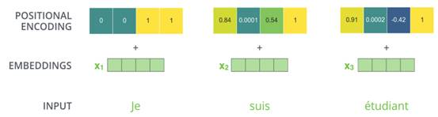

 

在一般的attention模型中，Q就是decoder的隐层，K就是encoder的隐层，V也是encoder的隐层。

在self-attention模型中，就是取Q，K，V相同，均为encoder或者decoder的word embedding +positional embedding转换所得。

 

 

然后采用了[残差网络](https://zhuanlan.zhihu.com/p/42706477) 中的short-cut结构

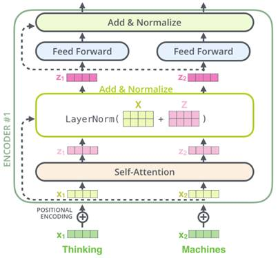（why？）

三、Decoder部分：

Encoder部分的输入是法语，Decoder部分的输入是英语。

Encoder部分的最后一个Encoder输出的是3个向量（因为输入有3个单词）

将每个向量转化为对应的key向量和value向量，带入每个Decoder中的“encoder-decoder attention”层中去计算。

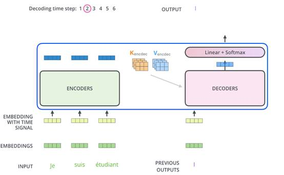

Encoder部分所有单词可以并行计算，一次性全部encoding得到输出。

Decoder部分要一个单词一个单词地进行解码，因为要从左往右地做翻译。(在机器翻译中，解码过程是一个顺序操作的过程，也就是当解码第i个特征向量时，我们只能看到第i-1及其之前的解码结果。而我们要计算的attention是根据当前词i和前面的词来的，不能是后面的。)

 

Decoder部分

Self-Attention：当前翻译和已经翻译的前文之间的关系；

Encoder-Decnoder Attention：当前翻译和编码的特征向量之间的关系。

 

 

\1. encoder self-attention：每个单词可以访问序列中的所有单词，输入的Q、K、V是encoder部分的word embedding +positional embedding 转换得来的。

\2. decoder self-attention： 每个单词只能够访问当前位置前面的单词，输入的Q、K、V是decoder部分的word embedding +positional embedding 转换得来的。

\3. encoder-decoder attention：输入的Q、K、V中，K和V来自encoder的self-attention输出，Q来自decoder的self-attention输出。

 

Decoder部分输出了一个英语单词后，要预测下一个单词，则取之前预测的这个单词作为输入做self-attention得到Q，再连同Encoder部分得来的K和V做encoder-decoder attention。该层输出经过全连接层后得到的输出又做self-attention得到Q，依此类推。

 

那到底decoder的第一个输入是哪里来的呢？

我猜测训练集是一句法语对应一句英语，因此第一个输入就是英语文本的第一个单词吧。

 

 Decoder的输出是浮点数的向量列表。我们是如何将其变成一个单词的呢？这就是最终的线性层和softmax层所做的工作。

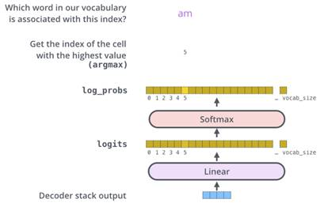

先是经过一个全连接层，如果英语Vocabulary中有10000个单词，则映射到一个10000维的向量上，再做softmax，得分最高的那个维度对应的vocabulary中的单词就是预测结果。

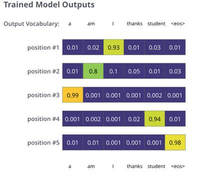

 