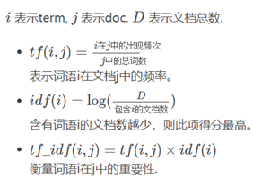
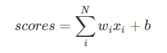
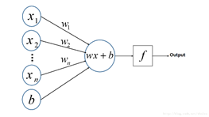
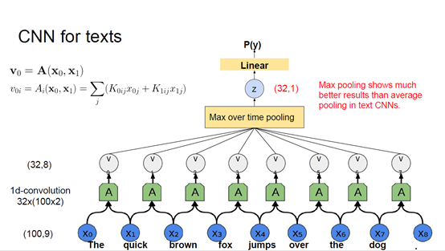
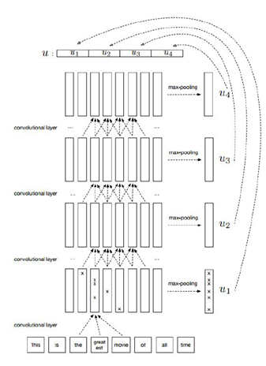

## **一、** **BOW，Bag of Words，词袋模型。**

统计一个文档中每个单词的出现次数形成一个向量，用以代表这个文档。

https://blog.csdn.net/u012507022/article/details/52442837

文档 1：“我喜欢跳舞，小明也喜欢。”

文档 2：“我也喜欢唱歌。”

基于以上这两个文档，便可以构造一个由文档中的关键词组成的词典：

词典={1:“我”，2:“喜欢”，3:“跳舞”，4:“小明”，5:“也”，6:“唱歌”}

这个词典一共包含6个不同的词语，利用词典的索引号，上面两个文档每一个都可以用一个6维向量表示（用整数数字0~n（n为正整数）表示某个单词在文档中出现的次数。这样，根据各个文档中关键词出现的次数，便可以将上述两个文档分别表示成向量的形式：

文档 1：[1, 2, 1, 1, 1, 0]

文档 2：[1, 1, 0, 0, 1, 1]

从上述的表示中，可以很清楚地看出来，在文档表示过程中并没有考虑关键词的顺序，而是仅仅将文档看成是一些关键词出现的概率的集合(这是Bag-of-words模型的缺点之一)，每个关键词之间是相互独立的，这样每个文档可以表示成关键词出现频率的统计集合，类似于直方图的统计表示。

 

加权词袋：为每个单词加上不同的权重

                

 

词袋模型原本就很稀疏，如果再加上n-gram思想则会更加稀疏（sparse）

 

 

**## 二、Dense text representation: NBOW**

BOW使用one-hot表示每个word，一个文档的representation其实就是其所含所有word的one-hot向量的和。

NBOW使用pre-trained word embedding来代表每个word，称为neural bag-of-words

优点：

1、低维         2、W2V或GloVe的预训练相当于利用了外部信息，实现迁移学习

3、Words are treated not identically (an embedding space hat its own non-trivial structure)

不是很懂

 

BOW、NBOW共同缺点：

1、  word vectors的权重没有定义好

2、  利用上下文信息的唯一方法是n-grams

解决方法：a learnable aggregation function，一个神经网络

 

**## 三、Multi-Layer Perceptron多层感知机**

*感知机PLA（Perceptron Linear Algorithm），用于二分类，只有一个一维权值矩阵W和一个b。

​      

PLA是一个线性的二分类器，对非线性的数据不能进行有效的分类。

 

多层感知机(MLP)由感知机(PLA)推广而来，最主要的特点是有多个神经元层，因此也叫深度神经网络(DNN: Deep Neural Networks)。

https://blog.csdn.net/xholes/article/details/78461164

感觉就跟BPNN一模一样。

 

 

## 四、CNN用于文本分类

   

1、  输入的每一个word用word embedding表示，其中每个embedding是一个100维向量，因此输入层是一个100*9的二维矩阵。

2、  卷积层的filter尺寸是100*2，相当于进行步长=1的卷积操作，有32个filter，每个filter相当于不同的特征提取器，因此经过卷积层后得到8个32维向量。

3、  Pooling 层使用max pooling对Filter的特征进行降维操作，形成最终的特征，即一个32维特征向量。对于此32维向量的每一个维度，都从这8个filter向量的对应维度元素中取最大值作为此维度的值。这个方法有两个缺点：

（1）通过取唯一的最大值，使得Pooling层只知道这个最大值是多少，没有保留其出现位置信息。比如主语出现位置一般在句子头，宾语一般出现在句子尾等等，这些位置信息其实有时候对于分类任务来说还是很重要的，但是Max Pooling 基本把这些信息抛掉了。

（2）此外因为Max Pooling只保留一个最大值，所以即使某个特征出现多次，现在也只能看到一次，就是说同一特征的强度信息丢失了。

4、  在Pooling层之后连接全联接层神经网络，形成最后的分类过程。

 

CNN的提高方法

1、同时使用size不同的卷积核、

2、Separate max-pooling over time and concatenation.（什么意思？），

3、k-max pooling 保留k个最大值而不是仅仅1个，且k个值按原本顺序排列

4、初始化时使用word embedding表示输入层的word，模型训练时将他们一并进行训练。

 

Hierarchical ConvNet分层ConvNet

   

每一层卷积层进行卷积运算得到的feature map都通过max-pooling得到一个特征向量，有4个卷积层，最后将四个特征向量拼接起来

 

## 五、RNN（Recurrent Neural Network）用于处理序列数据的神经网络

序列数据有一个特点——后面的数据跟前面的数据有关系。

https://blog.csdn.net/zhaojc1995/article/details/80572098

 

 

C-LSTM用CNN提取序列的high-level phrase representation，然后作为输入加入到LSTM中训练得到这个句子的representation。

 

Classical approaches vs. NNs

图像处理中的数据扩充：

\1. Geometric transformations (flips,crops, rotations, non-linear transformations)

\2. Various input dropout schemes

 

文本分类中的数据扩充：

1、Deformations (text pieces concatenation, paragraph reordering)

数据重组（文本段连接，段落重新排序）

2、Reformulations (e.g. translation back and forth)

将部分词语换成同义词

3、Word dropout，using word semantic similarity information

 