# 交叉熵

交叉熵（cross entropy）是深度学习中常用的一个概念，一般用来求目标与预测值之间的差距。

## 信息论

### 1 信息量

- 信息量小：概率大的事件发生了。

- 信息量大：概率小的事件发生了。

越不可能的事件发生时，我们获取到的信息量就越大。越可能发生的事件发生了，我们获取到的信息量就越小。

假设X是一个离散型随机变量，概率分布函数为 Pr(X=x)=p(x)，则定义事件X=x0的信息量为：

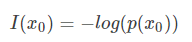

p(x)取值范围[0,1]，信息量图：

横坐标为概率p，纵坐标为信息量 I。概率越小，信息量越大，概率越大，信息量越小。

### 2 熵

对于某个事件，有n种可能性，每一种可能性都有一个概率p(xi)，可以计算出每个可能性的信息量，比如按下电脑开关的三种可能性：

| 序号 | 事件         | 概率p | 信息量I         |
| ---- | ------------ | ----- | --------------- |
| A    | 电脑正常开机 | 0.7   | -log(p(A))=0.36 |
| B    | 电脑无法开机 | 0.2   | -log(p(B))=1.61 |
| C    | 电脑爆炸了   | 0.1   | -log(p(C))=2.30 |

熵表示所有信息量的期望，定义熵为：

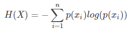

其实就是以每个可能性的概率为权重，对信息量做加权求和。

所以上面电脑开机问题的熵为

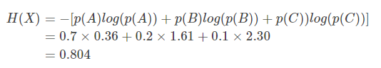

此外还有一类比较特殊的问题，比如投掷硬币只有两种可能，我们称之为0-1分布问题（二项分布的特例），对于这类问题，熵的计算方法可以简化为如下算式：

### 3 相对熵（KL散度）

 KL 散度用来衡量两个单独的概率分布 P(x) 和 Q(x)的差异，即如果用 P 来描述目标问题，而不是用 Q 来描述目标问题，得到的信息增量。

在机器学习中，用 P 来表示样本的真实分布，比如[1,0,0]表示当前样本属于第一类。用 Q 来表示模型所预测的分布，比如[0.7,0.2,0.1]。

用 Q 来描述样本，虽然可以大致描述，但是信息量不足，需要额外的一些“信息增量”才能达到和 P 一样完美的描述。模型训练就是为了降低这个所需的“信息增量”。如果我们的Q通过反复训练，直到不再需要额外的“信息增量”也能完美的描述样本，此时Q等价于P。

KL散度的计算公式：

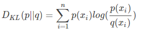

KL散度值越小，表示P分布和Q分布越接近。

### 4 交叉熵

KL散度公式拆开：

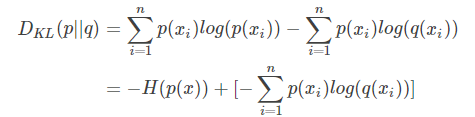

等式的前一部分恰巧就是p的熵的相反数，等式的后一部分，就是交叉熵：

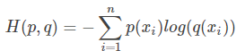

在机器学习中，我们需要评估label和predicts之间的差距，原本应该是使用KL散度的，但是由于KL散度中的前一部分 −H(p(x)) 只与真实label有关，是固定不变的，故在优化过程中，只需要关注交叉熵就可以了。所以一般在机器学习中直接用用交叉熵做loss，评估模型。

## 机器学习中交叉熵的应用

### 1 交叉熵在单分类问题中的使用

单分类问题，每一张图像样本只能有一个类别，交叉熵在单分类问题上基本是标配的loss function

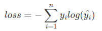

比如一个样本的label和预测概率分布：

| *     | 猫   | 青蛙 | 老鼠 |
| ----- | ---- | ---- | ---- |
| Label | 0    | 1    | 0    |
| Pred  | 0.3  | 0.6  | 0.1  |

> 单分类的Pred是用softmax算出来的，各个类别的概率之和为1

此样本的交叉熵计算过程如下：

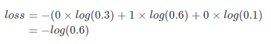

一个batch的loss则是每个sample的交叉熵loss平均值。

### 2 交叉熵在多分类问题中的使用

多分类问题，每一张图像样本可以同时有多个类别。单分类问题的标签为one-hot，多分类的标签是n-hot。

比如一个样本的label和预测概率分布：

| *     | 猫   | 青蛙 | 老鼠 |
| ----- | ---- | ---- | ---- |
| Label | 0    | 1    | 1    |
| Pred  | 0.1  | 0.7  | 0.8  |

> 多分类的Pred是用sigmoid算出来的，每个类别概率独立分布，交叉熵在这里是单独对每一个节点进行计算，每一个节点只有两种可能值，所以是一个二项分布。前面说过对于二项分布这种特殊的分布，熵的计算可以进行简化。同样的，交叉熵的计算也可以简化：
>
> 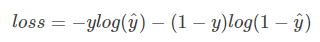

此样本的交叉熵计算过程如下：

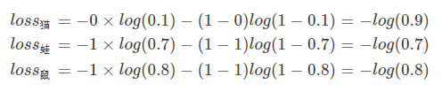

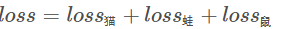

同样，一个batch的loss则是每个sample的交叉熵loss平均值。

> 参考博客  [一文搞懂交叉熵在机器学习中的使用，透彻理解交叉熵背后的直觉](https://blog.csdn.net/tsyccnh/article/details/79163834)