课程地址：[DeepRL](https://www.bilibili.com/video/av21399465?t=1176)    [PolicyGradientReview](https://www.bilibili.com/video/av24724071?from=search&seid=8731715752742519)     [课程主页](http://speech.ee.ntu.edu.tw/~tlkagk/courses_MLDS18.html)

也可以看一下这个博客https://blog.csdn.net/cindy_1102/article/details/87905272

强化学习示意图：components and process

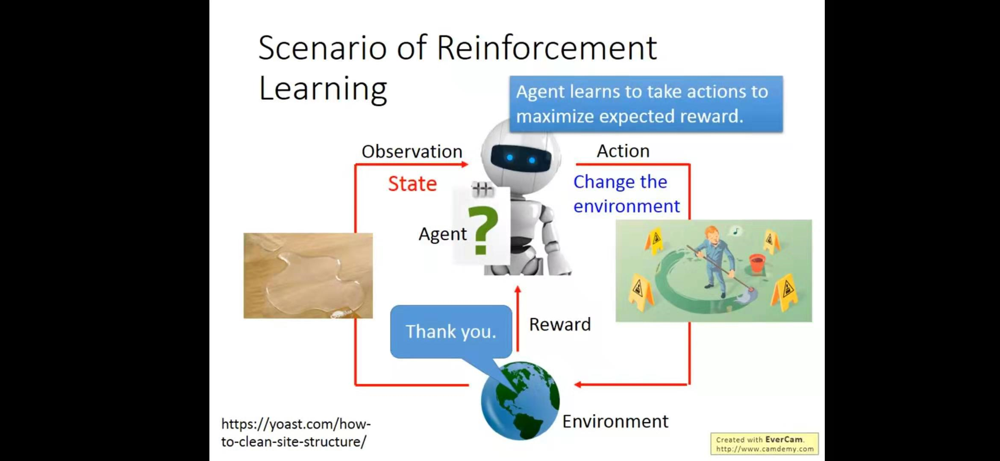

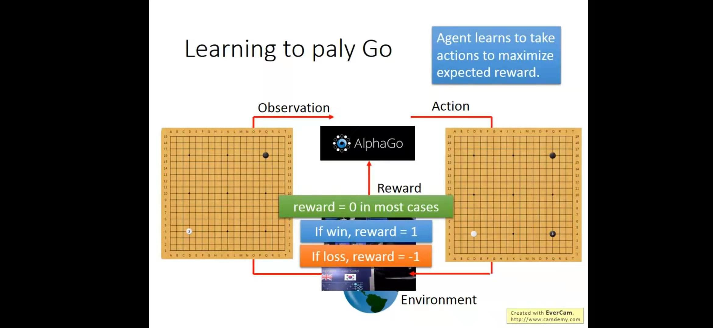

RL有policy-based和Value-based两个分类，这里我只看policy-based approach

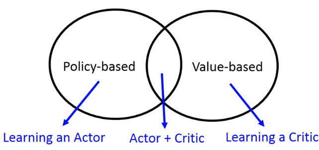

## Policy-based Approach

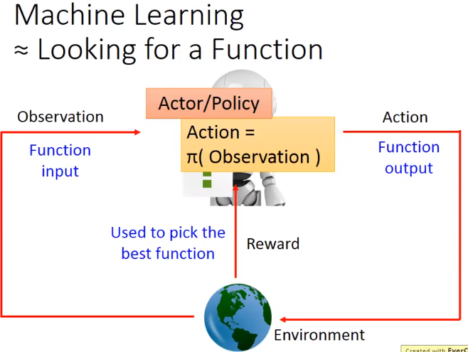

***

神经网络作为actor，泛化能力强，能处理没见过的状况。

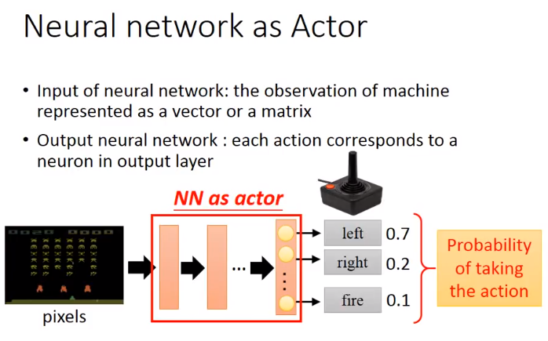

***

定义actor的效果好坏：reward的期望值

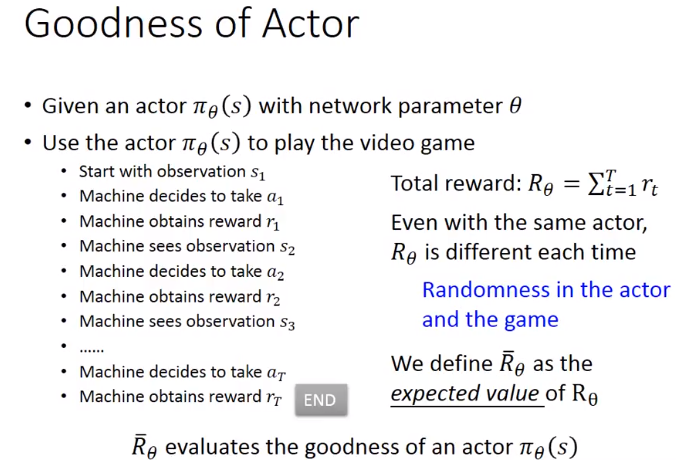

***

tao代表学习的整个过程，tao有很多种可能性，将所有可能性及其reward根据出现的概率取加权和，就是reward的期望值。但不可能穷举所有的可能性，所以一般简化为：用actor跑出N个tao，然后直接取它们reward的平均值。

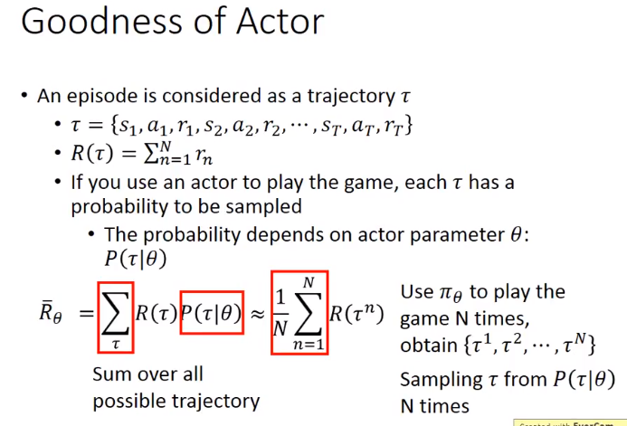

***

选一个最好的actor：用Gradient Ascent

神经网络的指标是Loss，用梯度下降。强化学习指标是reward，用梯度上升。

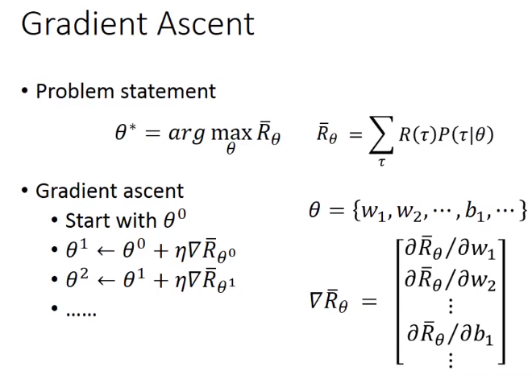

看到下面的红框，就可以换成跑N次取平均

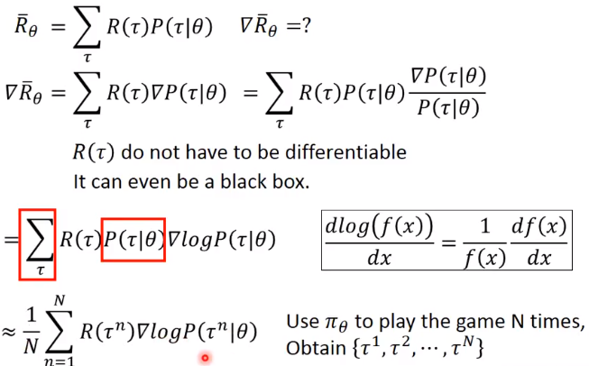

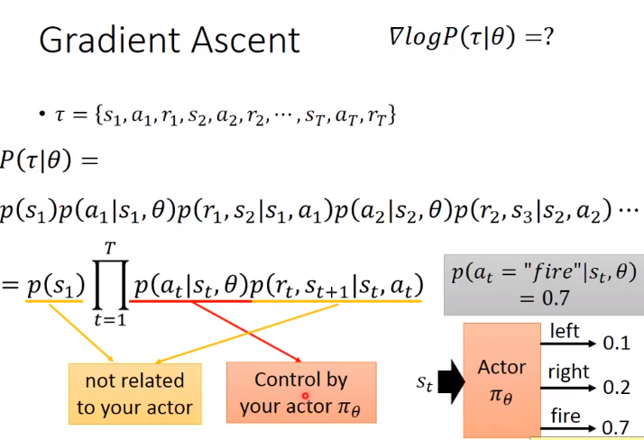

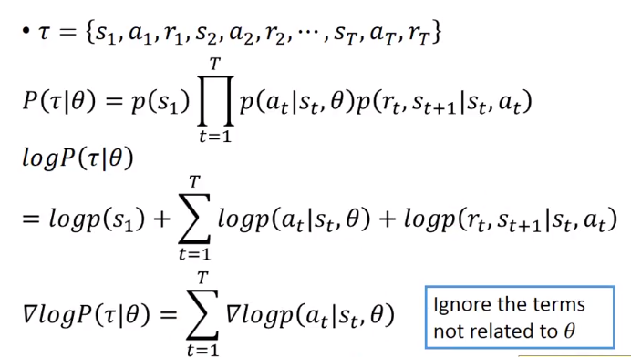

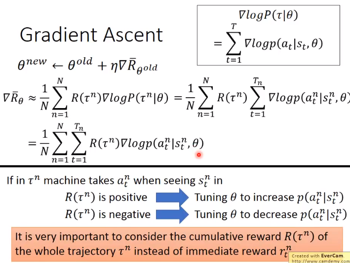

***

Policy Gradient过程：

先跑N次游戏，得到N个tao，然后做梯度上升，更新神经网络参数，接着再跑N次游戏。

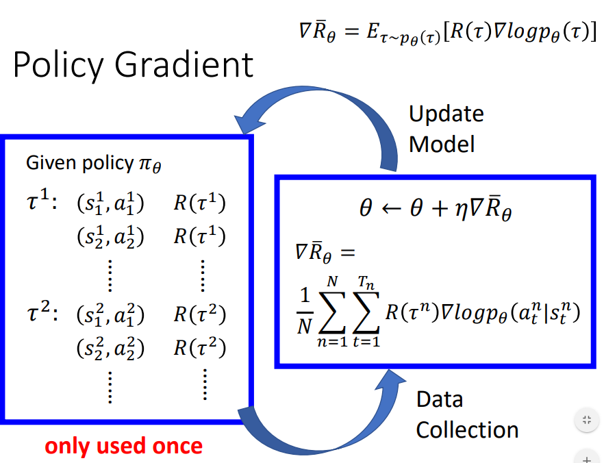

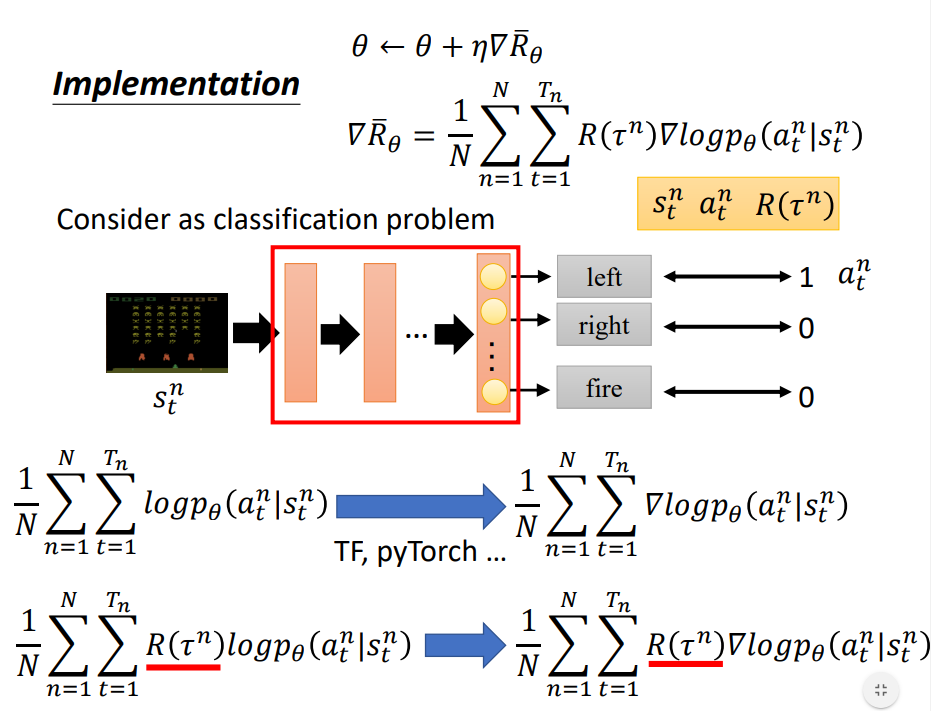

上面的公式是做deep learning时的优化函数，下面是做reinforcement learning时的优化函数，区别是后者要乘一个total reward。

***

Tip1：不希望所有reward都是正的，这会导致没被sample过的action后面出现的概率降低，所以给reward部分减了一个bias

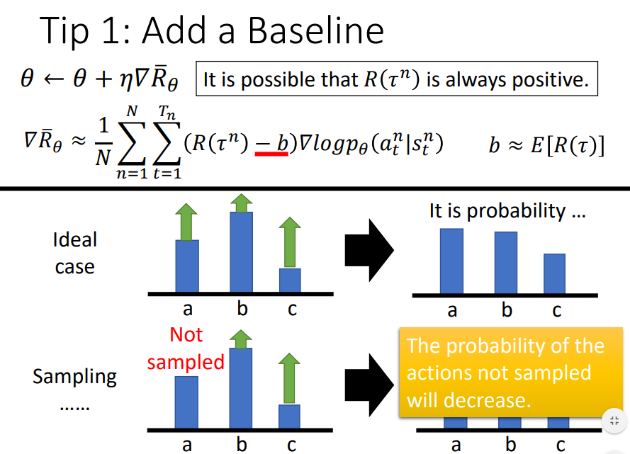

Tip2：不应该给同一个tao里的所有(state,action)对乘以同一个weight，应该给不同的action乘不同的weight。某一个action的reward，应该是自他以后的所有reward的总和，因为在此之前的reward与他无关，是之前的action的功劳。

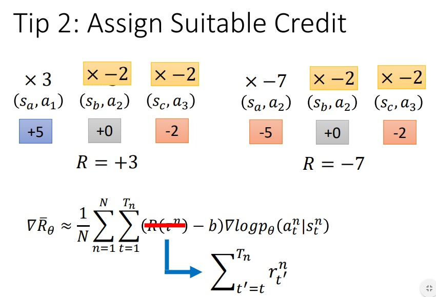

再考虑到一个action的影响随时间衰减，所以加上一个gamma参数，离action越远，乘的gamma次数越多

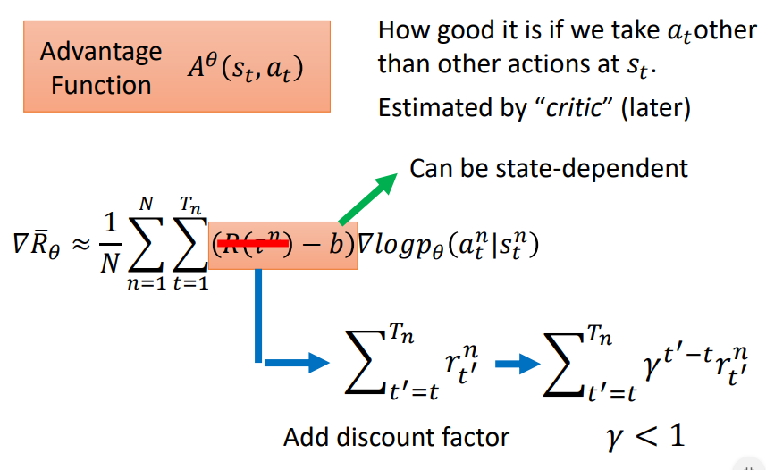