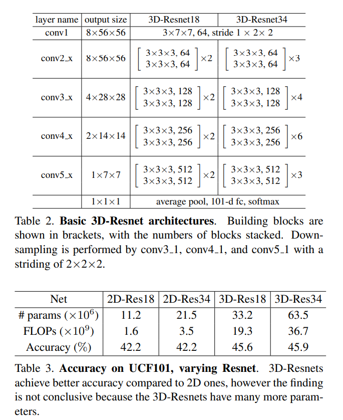
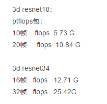

在pytorch环境下，有两个计算FLOPs和参数量的包thop和ptflops，结果基本是一致的。

## thop

参考https://github.com/Lyken17/pytorch-OpCounter

安装方法：pip install thop

使用方法：

```python
from torchvision.models import resnet18
from thop import profile
model = resnet18()
input = torch.randn(1, 3, 224, 224) #模型输入的形状,batch_size=1
flops, params = profile(model, inputs=(input, ))
print(flops/1e9,params/1e6) #flops单位G，para单位M
```

用来测试3d resnet18的FLOPs：

```python
model =C3D_Hash_Model(48)
input = torch.randn(1, 3,10, 112, 112) #视频取10帧
flops, params = profile(model, inputs=(input, ))
print(flops/1e9,params/1e6)
```


## ptflops

参考https://github.com/sovrasov/flops-counter.pytorch

安装方法：pip install pthflops

或者 pip install git+https://github.com/sovrasov/flops-counter.pytorch.git

使用方法：

```python
import torchvision.models as models
import torch
from ptflops import get_model_complexity_info

with torch.cuda.device(0):
  net = models.resnet18()
  flops, params = get_model_complexity_info(net, (3, 224, 224), as_strings=True, 		                        print_per_layer_stat=True) #不用写batch_size大小，默认batch_size=1
  print('Flops:  ' + flops)
  print('Params: ' + params)
```

用来测试3d resnet18的FLOPs：

```python
import torch
from ptflops.flops_counter import get_model_complexity_info
with torch.cuda.device(0):
    net = C3D_Hash_Model(48)
    flops, params = get_model_complexity_info(net, (3,10, 112, 112), as_strings=True, 	                print_per_layer_stat=True)
    print('Flops:  ' + flops)
    print('Params: ' + params)
```

如果安装ptflops出问题，可以直接到https://github.com/sovrasov/flops-counter.pytorch.git下载代码，然后直接把目录ptflops复制到项目代码中，通过from ptflops.flops_counter import get_model_complexity_info来调用函数计算FLOPs

## python计时程序运行时间

```python
import time

time_start=time.time()
#在这里运行模型
time_end=time.time()
print('totally cost',time_end-time_start)
```


相关于3d resnet的FLOPs的论文or博客：

1、似乎是3d resnet的原始论文

[ConvNet Architecture Search for Spatiotemporal Feature Learning](https://arxiv.org/pdf/1708.05038.pdf)



2、github上的3d resnet代码  https://github.com/kenshohara/3D-ResNets-PyTorch

对应的论文：[Can Spatiotemporal 3D CNNs Retrace the History of 2D CNNs and ImageNet?](https://arxiv.org/pdf/1711.09577.pdf)


奇怪的是在原论文里3d resnet18的FLOPs是19.3，参数量是33.2

而用thop和ptflops计算github上的3d resnet18的FLOPs是8左右，参数量是33.2

难道是thop和ptflops计算FLOPs错误？

此外，以下的计算结果得到是两倍的帧会带来两倍的flops，不知道准不准确：

